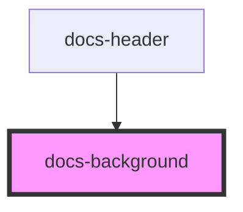

# docs-background

<!-- Auto Generated Below -->

## Properties

| Property  | Attribute | Description                  | Type                  | Default     |
| --------- | --------- | ---------------------------- | --------------------- | ----------- |
| `variant` | `variant` | Sets the background variant. | `"dark" \| "default"` | `'default'` |

## Dependencies

### Used by

-   [docs-header](../docs-header)

### Graph

---
