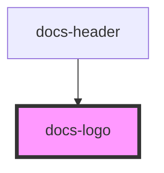

# docs-logo

<!-- Auto Generated Below -->

## Properties

| Property | Attribute | Description | Type     | Default |
| -------- | --------- | ----------- | -------- | ------- |
| `height` | `height`  |             | `number` | `40`    |
| `width`  | `width`   |             | `number` | `164`   |

## Dependencies

### Used by

-   [docs-header](../docs-header)

### Graph

---
