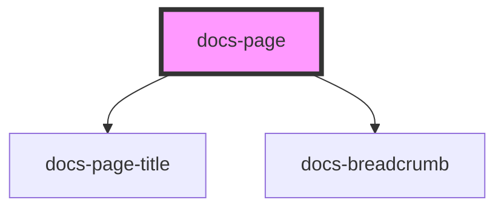

# docs-page

A basic page element

<!-- Auto Generated Below -->

## Properties

| Property                 | Attribute      | Description | Type                                    | Default     |
| ------------------------ | -------------- | ----------- | --------------------------------------- | ----------- |
| `crumbs`                 | --             |             | `Crumb[] \| undefined`                  | `undefined` |
| `empty`                  | `empty`        |             | `boolean`                               | `false`     |
| `headerRight`            | --             |             | `(() => VNode \| VNode[]) \| undefined` | `undefined` |
| `headerTitle`            | `header-title` |             | `boolean \| string \| undefined`        | `undefined` |
| `noSidebar`              | `no-sidebar`   |             | `boolean \| undefined`                  | `undefined` |
| `pageTitle` _(required)_ | `page-title`   |             | `string`                                | `undefined` |
| `renderEmptyState`       | --             |             | `(() => VNode \| VNode[]) \| undefined` | `undefined` |
| `state`                  | `state`        |             | `"loading" \| "ready" \| Error`         | `'ready'`   |

## Dependencies

### Depends on

-   [docs-page-title](../docs-page-title)
-   [docs-breadcrumb](../docs-breadcrumb)

### Graph

---
