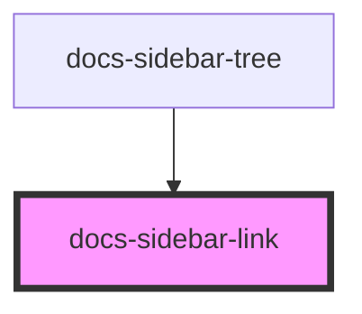

# docs-sidebar-link

<!-- Auto Generated Below -->

## Properties

| Property   | Attribute   | Description | Type                   | Default     |
| ---------- | ----------- | ----------- | ---------------------- | ----------- |
| `disabled` | `disabled`  |             | `boolean`              | `false`     |
| `icon`     | `icon`      |             | `string \| undefined`  | `undefined` |
| `url`      | `url`       |             | `string \| undefined`  | `undefined` |
| `urlMatch` | `url-match` |             | `string \| undefined`  | `undefined` |
| `variant`  | `variant`   |             | `"default" \| "small"` | `'default'` |

## Dependencies

### Used by

-   [docs-sidebar-tree](../docs-sidebar-tree)

### Graph

---
