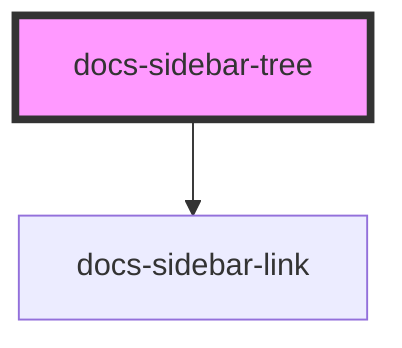

# docs-sidebar-tree

## Example

<docs-sidebar-tree root name={'Getting Started'}>
<docs-sidebar-tree
name={'install, run and write your first event'}
urlMatch={'/level_1'} >
<docs-sidebar-link url={'/level_1/a'}>
{'install and run Event Store'}
</docs-sidebar-link>
<docs-sidebar-link url={'/level_1/b'}>
{'Interacting with an Event Store server'}
</docs-sidebar-link>
<docs-sidebar-link url={'/level_1/level_1_2/a'}>
{'First call to HTTP API'}
</docs-sidebar-link>
<docs-sidebar-link url={'/level_1/level_1_2/a'}>
{'Connecting to Event Store'}
</docs-sidebar-link>
<docs-sidebar-link url={'/level_1/level_1_2/a'}>
{'Writing events to an Event Stream'}
</docs-sidebar-link>
<docs-sidebar-link url={'/level_1/level_1_2/a'}>
{'Next step'}
</docs-sidebar-link>
</docs-sidebar-tree>
<docs-sidebar-tree
name={'install, run and write your first event'}
urlMatch={'/level_1'} >
<docs-sidebar-link url={'/level_1/level_1_2/a'}>
{'Next step'}
</docs-sidebar-link>
</docs-sidebar-tree>
</docs-sidebar-tree>

```tsx
<docs-sidebar-tree root name={'Getting Started'}>
    <docs-sidebar-tree
        name={'install, run and write your first event'}
        urlMatch={'/level_1'}
    >
        <docs-sidebar-link url={'/level_1/a'}>
            {'install and run Event Store'}
        </docs-sidebar-link>
        <docs-sidebar-link url={'/level_1/b'}>
            {'Interacting with an Event Store server'}
        </docs-sidebar-link>
        <docs-sidebar-link url={'/level_1/level_1_2/a'}>
            {'First call to HTTP API'}
        </docs-sidebar-link>
        <docs-sidebar-link url={'/level_1/level_1_2/a'}>
            {'Connecting to Event Store'}
        </docs-sidebar-link>
        <docs-sidebar-link url={'/level_1/level_1_2/a'}>
            {'Writing events to an Event Stream'}
        </docs-sidebar-link>
        <docs-sidebar-link url={'/level_1/level_1_2/a'}>
            {'Next step'}
        </docs-sidebar-link>
    </docs-sidebar-tree>
    <docs-sidebar-tree
        name={'install, run and write your first event'}
        urlMatch={'/level_1'}
    >
        <docs-sidebar-link url={'/level_1/level_1_2/a'}>
            {'Next step'}
        </docs-sidebar-link>
    </docs-sidebar-tree>
</docs-sidebar-tree>
```

<!-- Auto Generated Below -->

## Properties

| Property            | Attribute   | Description | Type                  | Default     |
| ------------------- | ----------- | ----------- | --------------------- | ----------- |
| `icon`              | `icon`      |             | `string \| undefined` | `undefined` |
| `name` _(required)_ | `name`      |             | `string`              | `undefined` |
| `root`              | `root`      |             | `boolean`             | `false`     |
| `url`               | `url`       |             | `string \| undefined` | `undefined` |
| `urlMatch`          | `url-match` |             | `string \| undefined` | `undefined` |

## Dependencies

### Depends on

-   [docs-sidebar-link](../docs-sidebar-link)

### Graph



---
