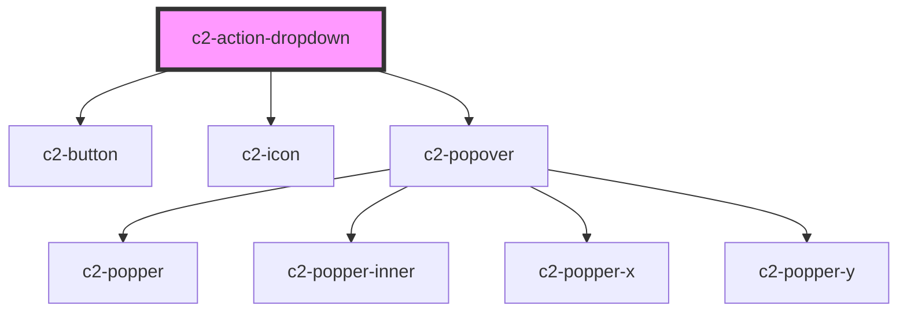

# c2-action-dropdown

<!-- Auto Generated Below -->


## Overview

A dropdown to display more actions than can be reasonably fit in a row.
All child actions must have the `dropdownItem` prop set.

## Usage

### Example

```tsx
import { ActionCopy, ActionDelete } from '@kurrent-ui/components';
import { createLogger } from '@kurrent-ui/utils';

const logger = createLogger('c2-action-dropdown');

export default () => (
    <c2-actions>
        <c2-action-dropdown>
            <c2-action
                dropdownItem
                icon={'lightbulb'}
                action={() => logger.log('clicked generic action')}
            >
                {'Generic action'}
            </c2-action>
            <c2-action-link dropdownItem url={'/cheese'} icon={'info'}>
                {'Link action'}
            </c2-action-link>
            <ActionCopy
                dropdownItem
                value={'Hello Copy'}
                toast={{
                    title: 'Copied!',
                    message: 'Successfully copied "Hello Copy" to clipboard',
                }}
            >
                {'Copy name'}
            </ActionCopy>
            <ActionDelete
                dropdownItem
                description={'ActionDelete'}
                deleteItem={async () => logger.log('deleted!')}
                modal={{
                    preHeading: 'Group name',
                    heading: 'ActionDelete',
                    body: 'Deleting this group will remove it from your organization. This operation cannot be undone.',
                    warning:
                        'Are you sure you want to proceed in deleting this group?',
                    confirm: 'Delete group',
                }}
                toast={{
                    title: 'Group deleted',
                    message: 'Successfully deleted',
                }}
            />
        </c2-action-dropdown>
    </c2-actions>
);
```


## Properties

| Property   | Attribute  | Description                         | Type                                                    | Default                    |
| ---------- | ---------- | ----------------------------------- | ------------------------------------------------------- | -------------------------- |
| `disabled` | `disabled` | If the dropdown should be disabled. | `boolean`                                               | `false`                    |
| `icon`     | `icon`     | The icon to show for the action.    | `[namespace: string \| symbol, name: string] \| string` | `[ICON_NAMESPACE, 'more']` |


## Dependencies

### Depends on

- [c2-button](../../buttons/button)
- [c2-icon](../../icon)
- [c2-popover](../../popover)

### Graph


----------------------------------------------


