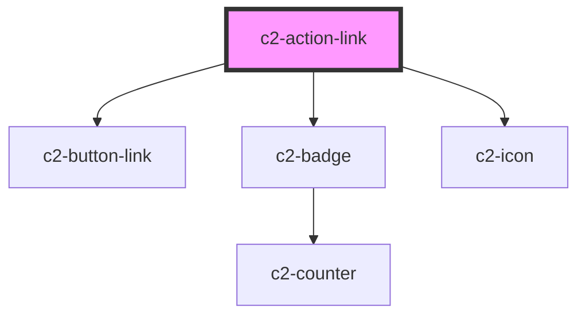

# c2-action-link


<!-- Auto Generated Below -->


## Overview

A link action.

## Usage

### Example

```tsx
export default () => (
    <c2-actions>
        <c2-action-link url={'/cheese'} icon={'users'}>
            {'Link action'}
        </c2-action-link>
    </c2-actions>
);
```


## Properties

| Property            | Attribute       | Description                                                                   | Type                                                    | Default     |
| ------------------- | --------------- | ----------------------------------------------------------------------------- | ------------------------------------------------------- | ----------- |
| `disabled`          | `disabled`      | If the action should be disabled.                                             | `boolean`                                               | `false`     |
| `dot`               | `dot`           | If a dot should be shown on the action, to indicate attention being required. | `"error" \| "okay" \| "warning" \| undefined`           | `undefined` |
| `dropdownItem`      | `dropdown-item` | If the action is within an `c2-action-dropdown`.                              | `boolean`                                               | `false`     |
| `icon` _(required)_ | `icon`          | The icon to show for the action.                                              | `[namespace: string \| symbol, name: string] \| string` | `undefined` |
| `url` _(required)_  | `url`           | The url to go to when clicked.                                                | `string`                                                | `undefined` |


## Slots

| Slot | Description                                                            |
| ---- | ---------------------------------------------------------------------- |
|      | The label for the action, applied to the link, or shown in a dropdown. |


## Dependencies

### Depends on

- [c2-button-link](../../buttons/button-link)
- [c2-badge](../../badge)
- [c2-icon](../../icon)

### Graph


----------------------------------------------


