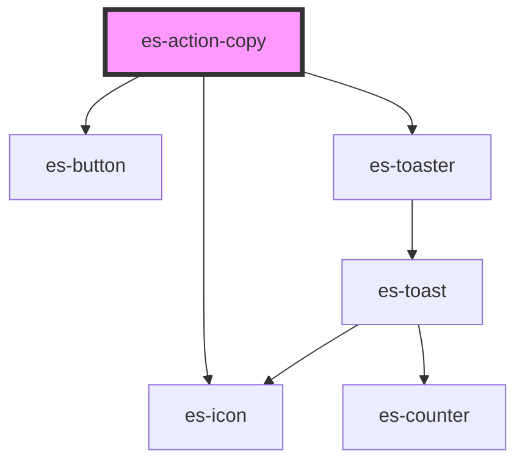

# es-action-copy


<!-- Auto Generated Below -->


## Overview

An action to copy a piece of text.

## Usage

### Example

```tsx
export default () => (
    <es-actions>
        <es-action-copy
            value={'hello copy'}
            toast={{
                title: 'Copied!',
                message: 'Successfully copied "hello copy" to clipboard',
            }}
        >
            {'Copy name'}
        </es-action-copy>
    </es-actions>
);
```


## Properties

| Property             | Attribute       | Description                                                      | Type                                                    | Default                    |
| -------------------- | --------------- | ---------------------------------------------------------------- | ------------------------------------------------------- | -------------------------- |
| `disabled`           | `disabled`      | If the action should be disabled.                                | `boolean`                                               | `false`                    |
| `dropdownItem`       | `dropdown-item` | If the action is within an `es-action-dropdown`.                 | `boolean`                                               | `false`                    |
| `icon`               | `icon`          | The icon to show for the action.                                 | `[namespace: string \| symbol, name: string] \| string` | `[ICON_NAMESPACE, 'copy']` |
| `toast` _(required)_ | --              | The details of the toast to be popped, when successfully copied. | `ToastOptions`                                          | `undefined`                |
| `value` _(required)_ | `value`         | The value to be copied when clicked.                             | `string`                                                | `undefined`                |


## Slots

| Slot | Description                                                              |
| ---- | ------------------------------------------------------------------------ |
|      | The label for the action, applied to the button, or shown in a dropdown. |


## Dependencies

### Depends on

- [es-button](../../buttons/es-button)
- [es-icon](../../es-icon)
- es-toaster

### Graph


----------------------------------------------


