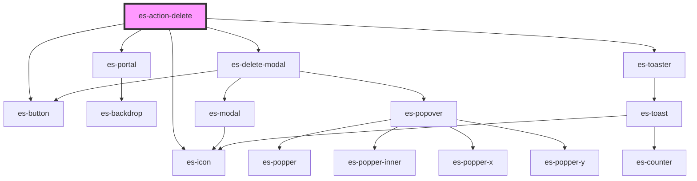

# es-action-delete


<!-- Auto Generated Below -->


## Overview

An action to delete something.

## Usage

### Example

```tsx
import { createLogger } from '@eventstore-ui/utils';

const logger = createLogger('es-actions');

export default () => (
    <es-actions>
        <es-action-delete
            description={'es-action-delete'}
            deleteItem={async () => logger.log('deleted!')}
            modalText={{
                preHeading: 'Group name',
                heading: 'es-action-delete',
                body: 'Deleting this group will remove it from your organization. This operation cannot be undone.',
                warning:
                    'Are you sure you want to proceed in deleting this group?',
                confirm: 'Delete group',
            }}
            toast={{
                title: 'Group deleted',
                message: 'Successfully deleted',
            }}
        />
    </es-actions>
);
```


## Properties

| Property                   | Attribute        | Description                                                          | Type                                                    | Default                     |
| -------------------------- | ---------------- | -------------------------------------------------------------------- | ------------------------------------------------------- | --------------------------- |
| `deleteItem` _(required)_  | --               | The function to call to delete the item.                             | `() => Promise<void>`                                   | `undefined`                 |
| `description` _(required)_ | `description`    | The name of the item being deleted.                                  | `string`                                                | `undefined`                 |
| `disabled`                 | `disabled`       | if the action should be disabled.                                    | `boolean`                                               | `false`                     |
| `dropdownItem`             | `dropdown-item`  | If the action is within an `es-action-dropdown`.                     | `boolean`                                               | `false`                     |
| `icon`                     | `icon`           | The icon to show for the action.                                     | `[namespace: string \| symbol, name: string] \| string` | `[ICON_NAMESPACE, 'trash']` |
| `modal` _(required)_       | --               | The text te display within the modal.                                | `DeleteModalOptions`                                    | `undefined`                 |
| `toast` _(required)_       | --               | The details of the toast to be popped, when successfully deleted.    | `ToastOptions`                                          | `undefined`                 |
| `typeToDelete`             | `type-to-delete` | If the user needs to type the passed description to enable deletion. | `boolean`                                               | `false`                     |


## Dependencies

### Depends on

- [es-button](../../buttons/es-button)
- [es-icon](../../es-icon)
- [es-portal](../../es-portal)
- [es-delete-modal](./components/es-delete-modal)
- es-toaster

### Graph


----------------------------------------------


