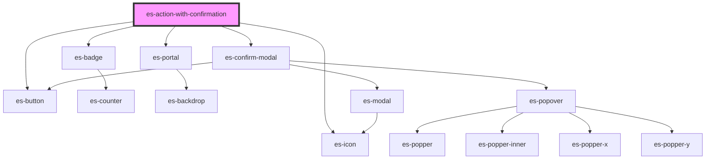

# es-action-with-confirmation

<!-- Auto Generated Below -->


## Overview

An action with a confirmation modal.

## Usage

### Example

```tsx
import { createLogger } from '@eventstore-ui/utils';

const logger = createLogger('es-actions');

export default () => (
    <es-actions>
        <es-action-with-confirmation
            icon={'trash'}
            action={async () => logger.log('deleted!')}
            typeToConfirm={'I want to delete'}
            modal={{
                preHeading: 'Group name',
                heading: 'es-action-confirmation',
                body: 'Deleting this group will remove it from your organization. This operation cannot be undone.',
                warning:
                    'Are you sure you want to proceed in deleting this group?',
                confirm: 'Delete group',
            }}
        >
            {'delete item'}
        </es-action-with-confirmation>
    </es-actions>
);
```


## Properties

| Property              | Attribute         | Description                                                                   | Type                                                    | Default     |
| --------------------- | ----------------- | ----------------------------------------------------------------------------- | ------------------------------------------------------- | ----------- |
| `action` _(required)_ | --                | The action to take when the button is clicked.                                | `() => any`                                             | `undefined` |
| `disabled`            | `disabled`        | if the action should be disabled.                                             | `boolean`                                               | `false`     |
| `dot`                 | `dot`             | If a dot should be shown on the action, to indicate attention being required. | `"error" \| "okay" \| "warning" \| undefined`           | `undefined` |
| `dropdownItem`        | `dropdown-item`   | If the action is within an `es-action-dropdown`.                              | `boolean`                                               | `false`     |
| `icon` _(required)_   | `icon`            | The icon to show for the action.                                              | `[namespace: string \| symbol, name: string] \| string` | `undefined` |
| `modal` _(required)_  | --                | The text to display within the modal.                                         | `ConfirmModalOptions`                                   | `undefined` |
| `typeToConfirm`       | `type-to-confirm` | If the user needs to type the passed string to enable confirmation.           | `string \| undefined`                                   | `undefined` |


## Dependencies

### Depends on

- [es-button](../../buttons/es-button)
- [es-badge](../../es-badge)
- [es-icon](../../es-icon)
- [es-portal](../../es-portal)
- [es-confirm-modal](./components/es-confirm-modal)

### Graph


----------------------------------------------


