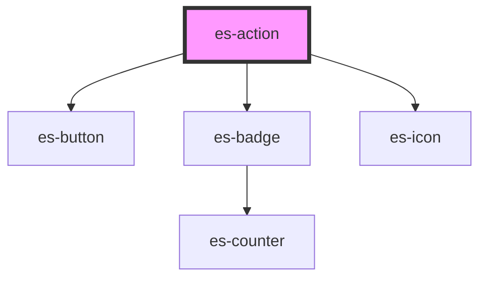

# es-action


<!-- Auto Generated Below -->


## Overview

A generic button action.

## Usage

### Example

```tsx
import { toast } from '@eventstore-ui/components';

export default () => (
    <es-actions>
        <es-action
            icon={'id-card'}
            action={() =>
                toast.info({
                    title: 'Clicked!',
                    message: 'Thank you for clicking.',
                })
            }
        >
            {'Generic action'}
        </es-action>
    </es-actions>
);
```


## Properties

| Property              | Attribute       | Description                                                                   | Type                                                    | Default     |
| --------------------- | --------------- | ----------------------------------------------------------------------------- | ------------------------------------------------------- | ----------- |
| `action` _(required)_ | --              | The action to take when the button is clicked.                                | `(e: MouseEvent) => any`                                | `undefined` |
| `disabled`            | `disabled`      | If the action should be disabled.                                             | `boolean`                                               | `false`     |
| `dot`                 | `dot`           | If a dot should be shown on the action, to indicate attention being required. | `"error" \| "okay" \| "warning" \| undefined`           | `undefined` |
| `dropdownItem`        | `dropdown-item` | If the action is within an `es-action-dropdown`.                              | `boolean`                                               | `false`     |
| `icon` _(required)_   | `icon`          | The icon to show for the action.                                              | `[namespace: string \| symbol, name: string] \| string` | `undefined` |


## Slots

| Slot | Description                                                              |
| ---- | ------------------------------------------------------------------------ |
|      | The label for the action, applied to the button, or shown in a dropdown. |


## Dependencies

### Depends on

- [es-button](../../buttons/es-button)
- [es-badge](../../es-badge)
- [es-icon](../../es-icon)

### Graph


----------------------------------------------


