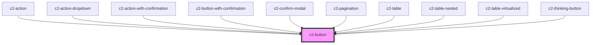

# c2-button

<!-- Auto Generated Below -->


## Overview

A button.

## Usage

### Example

```tsx
import type { ButtonVariant } from '@kurrent-ui/components';
import { randomIcon } from 'utils/helpers';

const variants: ButtonVariant[] = [
    'default',
    'filled',
    'outline',
    'delete',
    'cancel',
    'minimal',
    'link',
];

export default () =>
    variants.map((variant) => (
        <>
            <c2-button variant={variant} onClick={console.log}>
                <c2-icon icon={randomIcon()} slot={'before'} />
                {`${variant} variant`}
            </c2-button>
            <c2-button variant={variant} onClick={console.log}>
                <c2-icon icon={randomIcon()} size={22} />
            </c2-button>
            <c2-button variant={variant} onClick={console.log} disabled>
                <c2-icon icon={randomIcon()} slot={'before'} />
                {`${variant} (disabled)`}
            </c2-button>
        </>
    ));
```

```css
:host {
    display: grid;
    grid-template-columns: auto auto auto;
    gap: 20px;
    align-items: center;
    justify-items: center;
}
```


## Properties

| Property   | Attribute  | Description                                                                                                     | Type                                                                                | Default     |
| ---------- | ---------- | --------------------------------------------------------------------------------------------------------------- | ----------------------------------------------------------------------------------- | ----------- |
| `disabled` | `disabled` | If the button is disabled. Prevents the user from interacting with the button: it cannot be pressed or focused. | `boolean \| undefined`                                                              | `undefined` |
| `type`     | `type`     | The default behavior of the button.                                                                             | `string`                                                                            | `'button'`  |
| `variant`  | `variant`  | Which styling variant to use.                                                                                   | `"cancel" \| "default" \| "delete" \| "filled" \| "link" \| "minimal" \| "outline"` | `'default'` |


## Slots

| Slot       | Description                                          |
| ---------- | ---------------------------------------------------- |
| `"after"`  | Placed after the main content with correct padding.  |
| `"before"` | Placed before the main content with correct padding. |


## Shadow Parts

| Part       | Description                                |
| ---------- | ------------------------------------------ |
| `"button"` | The internal button element.               |
| `"inner"`  | The inner span, wrapping the default slot. |


## CSS Custom Properties

| Name                    | Description                                                 |
| ----------------------- | ----------------------------------------------------------- |
| `--align-inner`         | The flex align of the button content.                       |
| `--background-color`    | Directly set the background color of the button.            |
| `--border-color`        | Directly set the border color of the button.                |
| `--border-radius`       | The border radius of the button.                            |
| `--border-width`        | The border width of the button.                             |
| `--focus-color`         | Sets the color of the outline on focus.                     |
| `--foreground-color`    | Directly set the foreground color of the button.            |
| `--primary-color`       | Sets the primary theming color                              |
| `--secondary-color`     | Sets the secondary theming color                            |
| `--spacing`             | Internal spacing of the button (padding and between slots). |
| `--tertiary-color`      | Sets the tertiary theming color                             |
| `--text-decoration`     | The text decoration of the button.                          |
| `--transition-duration` | The transition duration of the button.                      |


## Dependencies

### Used by

 - [c2-action](../../actions/action)
 - [c2-action-dropdown](../../actions/action-dropdown)
 - [c2-action-with-confirmation](../../actions/action-with-confirmation)
 - [c2-button-with-confirmation](../button-with-confirmation)
 - [c2-confirm-modal](../../modals/confirm-modal)
 - [c2-pagination](../../pagination)
 - [c2-table](../../tables/table)
 - [c2-table-nested](../../tables/table-nested)
 - [c2-table-virtualized](../../tables/table-virtualized)
 - [c2-thinking-button](../thinking-button)

### Graph


----------------------------------------------


