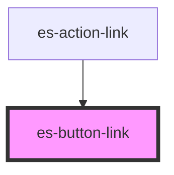

# es-button-link

<!-- Auto Generated Below -->


## Overview

Anchor link version of es-button, wraps a `Link` from `@kurrent-ui/router`.

## Usage

### Example

```tsx
import type { ButtonVariant } from '@eventstore-ui/components';
import { randomIcon } from 'utils/helpers';

const variants: ButtonVariant[] = [
    'default',
    'filled',
    'outline',
    'delete',
    'cancel',
    'minimal',
    'link',
];

export default () =>
    variants.map((variant) => (
        <>
            <es-button-link
                external
                variant={variant}
                url={'https://www.youtube.com/watch?v=dQw4w9WgXcQ'}
            >
                {`${variant} variant`}
                <es-icon icon={randomIcon()} slot={'after'} />
            </es-button-link>
            <es-button-link
                external
                variant={variant}
                url={'https://www.youtube.com/watch?v=dQw4w9WgXcQ'}
            >
                <es-icon icon={randomIcon()} size={22} />
            </es-button-link>
            <es-button-link
                disabled
                external
                variant={variant}
                url={'https://www.youtube.com/watch?v=dQw4w9WgXcQ'}
            >
                {`${variant} (disabled)`}
                <es-icon icon={randomIcon()} slot={'after'} />
            </es-button-link>
        </>
    ));
```

```css
:host {
    display: grid;
    grid-template-columns: auto auto auto;
    gap: 20px;
    align-items: center;
    justify-items: center;
}
```


## Properties

| Property         | Attribute          | Description                                                                                                 | Type                                                                                | Default     |
| ---------------- | ------------------ | ----------------------------------------------------------------------------------------------------------- | ----------------------------------------------------------------------------------- | ----------- |
| `anchorClass`    | `anchor-class`     | Class for the contained anchor element                                                                      | `string \| undefined`                                                               | `undefined` |
| `anchorId`       | `anchor-id`        | Id for the contained anchor element                                                                         | `string \| undefined`                                                               | `undefined` |
| `anchorRole`     | `anchor-role`      | Role for the contained anchor element                                                                       | `string \| undefined`                                                               | `undefined` |
| `anchorTabIndex` | `anchor-tab-index` | Tab Index for the contained anchor element                                                                  | `string \| undefined`                                                               | `undefined` |
| `anchorTitle`    | `anchor-title`     | Title for the contained anchor element                                                                      | `string \| undefined`                                                               | `undefined` |
| `disabled`       | `disabled`         | If the link is disabled. Prevents the user from interacting with the link: it cannot be pressed or focused. | `boolean \| undefined`                                                              | `undefined` |
| `external`       | `external`         | Link is for an external site                                                                                | `boolean \| undefined`                                                              | `undefined` |
| `forceRefresh`   | `force-refresh`    | If the button should navigate within the router context, or force a refresh.                                | `boolean \| undefined`                                                              | `undefined` |
| `target`         | `target`           | Target for link (eg: target="_blank")                                                                       | `string \| undefined`                                                               | `undefined` |
| `url`            | `url`              | Where the button should link to.                                                                            | `string \| undefined`                                                               | `undefined` |
| `variant`        | `variant`          | Which styling variant to use                                                                                | `"cancel" \| "default" \| "delete" \| "filled" \| "link" \| "minimal" \| "outline"` | `'default'` |


## Slots

| Slot       | Description                                          |
| ---------- | ---------------------------------------------------- |
| `"after"`  | Placed after the main content with correct padding.  |
| `"before"` | Placed before the main content with correct padding. |


## Shadow Parts

| Part      | Description                                |
| --------- | ------------------------------------------ |
| `"inner"` | The inner span, wrapping the default slot. |
| `"link"`  | The internal a element.                    |


## CSS Custom Properties

| Name                    | Description                                                 |
| ----------------------- | ----------------------------------------------------------- |
| `--align-inner`         | The flex align of the button content.                       |
| `--background-color`    | Directly set the background color of the button.            |
| `--border-color`        | Directly set the border color of the button.                |
| `--border-radius`       | The border radius of the button.                            |
| `--border-width`        | The border width of the button.                             |
| `--focus-color`         | Sets the color of the outline on focus.                     |
| `--foreground-color`    | Directly set the foreground color of the button.            |
| `--primary-color`       | Sets the primary theming color                              |
| `--secondary-color`     | Sets the secondary theming color                            |
| `--spacing`             | Internal spacing of the button (padding and between slots). |
| `--tertiary-color`      | Sets the tertiary theming color                             |
| `--text-decoration`     | The text decoration of the button.                          |
| `--transition-duration` | The transition duration of the button.                      |


## Dependencies

### Used by

 - [es-action-link](../../actions/es-action-link)

### Graph


----------------------------------------------


