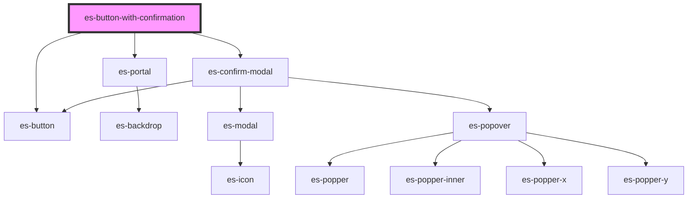

# es-action-with-confirmation

<!-- Auto Generated Below -->


## Overview

A button with a confirmation modal.

## Usage

### Example

```tsx
import { createLogger } from '@eventstore-ui/utils';

const logger = createLogger('es-button-with-confirmation');

export default () => (
    <es-button-with-confirmation
        variant={'delete'}
        action={() => logger.log('deleted!')}
        typeToConfirm={'I want to delete'}
        modal={{
            preHeading: 'Group name',
            heading: 'es-button-confirmation',
            body: 'Deleting this group will remove it from your organization. This operation cannot be undone.',
            warning: 'Are you sure you want to proceed in deleting this group?',
            confirm: 'Delete group',
        }}
    >
        <es-icon icon={'trash'} slot={'before'} />
        {'delete item'}
    </es-button-with-confirmation>
);
```


## Properties

| Property              | Attribute         | Description                                                                                                     | Type                                                                                | Default     |
| --------------------- | ----------------- | --------------------------------------------------------------------------------------------------------------- | ----------------------------------------------------------------------------------- | ----------- |
| `action` _(required)_ | --                | The action to be called on click.                                                                               | `() => any`                                                                         | `undefined` |
| `disabled`            | `disabled`        | If the button is disabled. Prevents the user from interacting with the button: it cannot be pressed or focused. | `boolean`                                                                           | `false`     |
| `modal` _(required)_  | --                | The text to display within the modal.                                                                           | `ConfirmModalOptions`                                                               | `undefined` |
| `type`                | `type`            | The default behavior of the button.                                                                             | `string`                                                                            | `'button'`  |
| `typeToConfirm`       | `type-to-confirm` | If the user needs to type the passed string to enable confirmation.                                             | `string \| undefined`                                                               | `undefined` |
| `variant`             | `variant`         | Which styling variant to use.                                                                                   | `"cancel" \| "default" \| "delete" \| "filled" \| "link" \| "minimal" \| "outline"` | `'default'` |


## Slots

| Slot       | Description                                          |
| ---------- | ---------------------------------------------------- |
| `"after"`  | Placed after the main content with correct padding.  |
| `"before"` | Placed before the main content with correct padding. |


## Shadow Parts

| Part       | Description |
| ---------- | ----------- |
| `"button"` | The button. |


## Dependencies

### Depends on

- [es-button](../es-button)
- [es-portal](../../es-portal)
- [es-confirm-modal](../../modals/es-confirm-modal)

### Graph


----------------------------------------------


