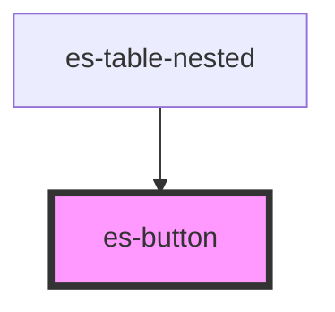

# es-button

<!-- Auto Generated Below -->

## Properties

| Property   | Attribute  | Description | Type                                            | Default     |
| ---------- | ---------- | ----------- | ----------------------------------------------- | ----------- |
| `color`    | `color`    |             | `"primary" \| "secondary" \| "text" \| "white"` | `'primary'` |
| `disabled` | `disabled` |             | `boolean \| undefined`                          | `undefined` |
| `form`     | `form`     |             | `string \| undefined`                           | `undefined` |
| `type`     | `type`     |             | `string`                                        | `'button'`  |
| `variant`  | `variant`  |             | `"filled" \| "link" \| "minimal" \| "outline"`  | `'filled'`  |

## Dependencies

### Used by

 - [es-table-nested](../../es-table-nested)

### Graph

----------------------------------------------

*Built with [StencilJS](https://stenciljs.com/)*
