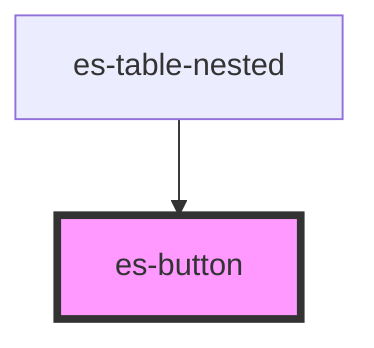

# es-button


<!-- Auto Generated Below -->


## Usage

### Example

```tsx
import { randomIcon } from 'helpers';

export default () =>
    ['filled', 'outline', 'minimal', 'link'].map((variant) =>
        ['primary', 'secondary', 'white', 'text'].map((color) => (
            <es-button variant={variant} color={color} onClick={console.log}>
                <es-icon icon={randomIcon()} slot={'before'} />
                {`${variant} ${color}`}
            </es-button>
        )),
    );
```

```css
:host {
    display: grid;
    grid-template-columns: auto auto;
    gap: 20px;
    align-items: center;
    justify-items: center;
}
```


## Properties

| Property   | Attribute  | Description                                                                                                     | Type                                            | Default     |
| ---------- | ---------- | --------------------------------------------------------------------------------------------------------------- | ----------------------------------------------- | ----------- |
| `color`    | `color`    | Which color pair the button should use                                                                          | `"primary" \| "secondary" \| "text" \| "white"` | `'primary'` |
| `disabled` | `disabled` | If the button is disabled. Prevents the user from interacting with the button: it cannot be pressed or focused. | `boolean \| undefined`                          | `undefined` |
| `form`     | `form`     | The form element to associate the button with (its form owner).                                                 | `string \| undefined`                           | `undefined` |
| `type`     | `type`     | The default behavior of the button.                                                                             | `string`                                        | `'button'`  |
| `variant`  | `variant`  | Which styling variant to use                                                                                    | `"filled" \| "link" \| "minimal" \| "outline"`  | `'filled'`  |


## Slots

| Slot       | Description                                          |
| ---------- | ---------------------------------------------------- |
| `"after"`  | Placed after the main content with correct padding.  |
| `"before"` | Placed before the main content with correct padding. |


## CSS Custom Properties

| Name                    | Description                                                 |
| ----------------------- | ----------------------------------------------------------- |
| `--align-inner`         | The flex align of the button content.                       |
| `--background-color`    | Directly control the background color of the button.        |
| `--border-radius`       | The border radius of the button.                            |
| `--border-width`        | The border width of the button.                             |
| `--contrast-color`      | The background color of the button. (text, border, icon).   |
| `--current-color`       | The foreground color of the button. (text, border, icon).   |
| `--spacing`             | Internal spacing of the button (padding and between slots). |
| `--text-color`          | Directly control the text color of the button.              |
| `--text-decoration`     | The text decoration of the button.                          |
| `--transition-duration` | The transition duration of the button.                      |


## Dependencies

### Used by

 - [es-table-nested](../../es-table-nested)

### Graph


----------------------------------------------


