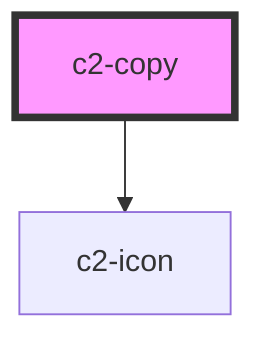

# c2-copy


<!-- Auto Generated Below -->


## Overview

Copies the text passed as a child when clicked.

## Usage

### Example

```tsx
export default () => (
    <c2-copy>{'Click to copy this text to your clipboard.'}</c2-copy>
);
```

```css
:host {
    display: flex;
    align-items: center;
    justify-content: center;
}
```


## Methods

### `copy() => Promise<void>`

Manually triggers the copy of the inner text.

#### Returns

Type: `Promise<void>`


## Dependencies

### Depends on

- [c2-icon](../icon)

### Graph


----------------------------------------------


