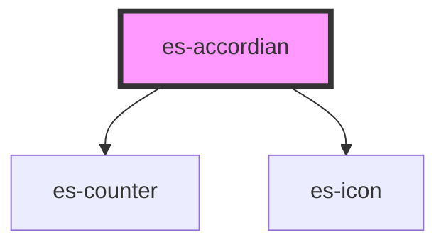

# es-accordian

<!-- Auto Generated Below -->

## Properties

| Property                | Attribute | Description | Type                 | Default     |
| ----------------------- | --------- | ----------- | -------------------- | ----------- |
| `sections` _(required)_ | --        |             | `AccordianSection[]` | `undefined` |
| `steps`                 | `steps`   |             | `boolean`            | `false`     |

## Dependencies

### Depends on

- [es-counter](../es-counter)
- [es-icon](../es-icon)

### Graph

----------------------------------------------

*Built with [StencilJS](https://stenciljs.com/)*
