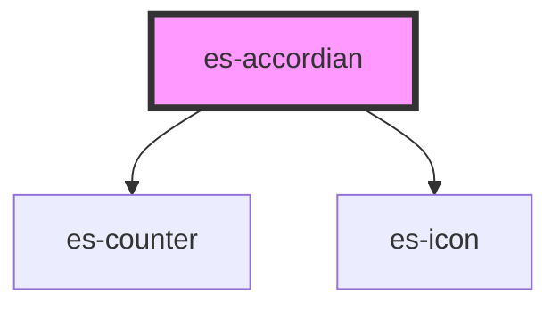

# es-accordian


<!-- Auto Generated Below -->


## Overview

Optionally collapsible sectioned view. Each section can be targeted via a part.

## Usage

### Example

```tsx
const sections = [
    {
        name: 'section-1',
        title: 'Section 1',
        variant: 'text',
    },
    {
        name: 'section-2',
        title: 'Collapsable',
        variant: 'text',
        collapsable: true,
    },
    {
        name: 'section-3',
        title: 'Collapsed by default',
        variant: 'text',
        collapsable: true,
        defaultCollapsed: true,
    },
    {
        name: 'section-4',
        title: 'Works with inputs',
        variant: 'field',
        collapsable: true,
    },
];

export default () => (
    <es-accordian sections={sections}>
        <p slot={'section-1'}>{'I am in section 1'}</p>
        <p slot={'section-2'}>{'You can collapse this section'}</p>
        <p slot={'section-3'}>
            {'Hello 👋. You can alt-click to collapse or open all sections.'}
        </p>
        <es-input slot={'section-4'} value={'hello'} label={'My Field'} />
    </es-accordian>
);
```


## Properties

| Property                | Attribute | Description                                  | Type                 | Default     |
| ----------------------- | --------- | -------------------------------------------- | -------------------- | ----------- |
| `sections` _(required)_ | --        | An array of sections to display.             | `AccordianSection[]` | `undefined` |
| `steps`                 | `steps`   | Display numbered counters beside each title. | `boolean`            | `false`     |


## Slots

| Slot              | Description                                                      |
| ----------------- | ---------------------------------------------------------------- |
| `"[sectionName]"` | Slots are created based off of the names of the passed sections. |


## Shadow Parts

| Part                      | Description                                                 |
| ------------------------- | ----------------------------------------------------------- |
| `"[sectionName]"`         | Target the outer section by name.                           |
| `"section"`               | Target the outer section.                                   |
| `"section_content"`       | Target the content wrapper of each section.                 |
| `"section_content_inner"` | Target the content of each section.                         |
| `"section_header"`        | Target the header of each section.                          |
| `"section_header_icon"`   | Target the collapse icon of each section (if collapseable). |
| `"section_header_title"`  | Target the header text of each section.                     |


## Dependencies

### Depends on

- [es-counter](../es-counter)
- [es-icon](../es-icon)

### Graph


----------------------------------------------


