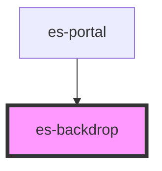

# es-backdrop

<!-- Auto Generated Below -->

## Properties

| Property       | Attribute       | Description | Type      | Default |
| -------------- | --------------- | ----------- | --------- | ------- |
| `showBackdrop` | `show-backdrop` |             | `boolean` | `false` |

## Events

| Event          | Description | Type               |
| -------------- | ----------- | ------------------ |
| `closed`       |             | `CustomEvent<any>` |
| `requestClose` |             | `CustomEvent<any>` |

## Methods

### `close() => Promise<void>`

#### Returns

Type: `Promise<void>`

### `renderNode(node: VNode | null) => Promise<void>`

#### Returns

Type: `Promise<void>`

## Dependencies

### Used by

 - [es-portal](../es-portal)

### Graph

----------------------------------------------

