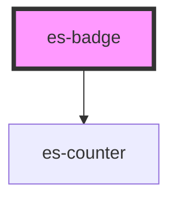

# es-badge

<!-- Auto Generated Below -->

## Properties

| Property             | Attribute   | Description | Type                                          | Default     |
| -------------------- | ----------- | ----------- | --------------------------------------------- | ----------- |
| `color`              | `color`     |             | `"error" \| "okay" \| "warning"`              | `'error'`   |
| `count` _(required)_ | `count`     |             | `number`                                      | `undefined` |
| `showZero`           | `show-zero` |             | `boolean`                                     | `false`     |
| `size`               | `size`      |             | `number \| undefined`                         | `undefined` |
| `variant`            | `variant`   |             | `"dot" \| "filled" \| "minimal" \| "outline"` | `'filled'`  |

## Dependencies

### Depends on

- [es-counter](../es-counter)

### Graph

----------------------------------------------

*Built with [StencilJS](https://stenciljs.com/)*
