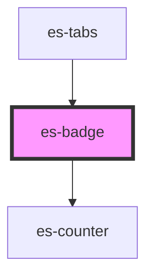

# es-badge

<!-- Auto Generated Below -->


## Overview

Display a counter or dot beside a component to indicate action being required.

## Usage

### Example

```tsx
import { createStore } from '@eventstore-ui/stores';

interface CountStore {
    error: number;
    warning: number;
    okay: number;
}

const { state } = createStore<CountStore>({
    error: 1,
    warning: 0,
    okay: 1000,
});

export default () => (
    <>
        {/* counters */}

        <es-badge color={'error'} count={state.error}>
            <es-button onClick={() => (state.error += 1)}>{'Error'}</es-button>
        </es-badge>

        <es-badge color={'warning'} count={state.warning}>
            <es-button onClick={() => (state.warning += 1)}>
                {'Warning'}
            </es-button>
        </es-badge>

        <es-badge color={'okay'} count={state.okay}>
            <es-button onClick={() => (state.okay += 1)}>{'Okay'}</es-button>
        </es-badge>

        {/* variants */}

        <es-badge color={'error'} count={state.error} variant={'outline'}>
            <es-icon icon={'cog'} />
        </es-badge>

        <es-badge color={'warning'} count={state.warning} showZero>
            <es-icon icon={'cog'} />
        </es-badge>

        <es-badge color={'okay'} count={state.okay} variant={'minimal'}>
            <es-icon icon={'cog'} />
        </es-badge>

        {/* dot */}

        <es-badge variant={'dot'} color={'error'} count={state.error}>
            <es-button variant={'outline'} onClick={() => (state.error += 1)}>
                {'Error'}
            </es-button>
        </es-badge>

        <es-badge variant={'dot'} color={'warning'} count={state.warning}>
            <es-button variant={'outline'} onClick={() => (state.warning += 1)}>
                {'Warning'}
            </es-button>
        </es-badge>

        <es-badge variant={'dot'} color={'okay'} count={state.okay}>
            <es-button variant={'outline'} onClick={() => (state.okay += 1)}>
                {'Okay'}
            </es-button>
        </es-badge>
    </>
);
```

```css
:host {
    display: grid;
    grid-template-columns: auto auto auto;
    gap: 40px;
    align-items: center;
    justify-items: center;
    justify-content: center;
    align-content: center;
}
```


## Properties

| Property             | Attribute   | Description                                                          | Type                                          | Default     |
| -------------------- | ----------- | -------------------------------------------------------------------- | --------------------------------------------- | ----------- |
| `color`              | `color`     | Choose the color variant of the badge                                | `"error" \| "okay" \| "warning" \| undefined` | `'error'`   |
| `count` _(required)_ | `count`     | What number to display in the counter (or if the dot should display) | `number`                                      | `undefined` |
| `showZero`           | `show-zero` | Show the dot and counter even if the count 0 (or negative)           | `boolean`                                     | `false`     |
| `size`               | `size`      | The base size (in px) of the counter (has no effect on the dot)      | `number \| undefined`                         | `undefined` |
| `variant`            | `variant`   | Select the display variant of the badge                              | `"dot" \| "filled" \| "minimal" \| "outline"` | `'filled'`  |


## CSS Custom Properties

| Name                       | Description                                                                       |
| -------------------------- | --------------------------------------------------------------------------------- |
| `--badge-background-color` | Background color of the badge. Can be set to a default via the color prop.        |
| `--badge-foreground-color` | Foreground (text) color of the badge. Can be set to a default via the color prop. |


## Dependencies

### Used by

 - [es-tabs](../es-tabs)

### Depends on

- [es-counter](../es-counter)

### Graph


----------------------------------------------


