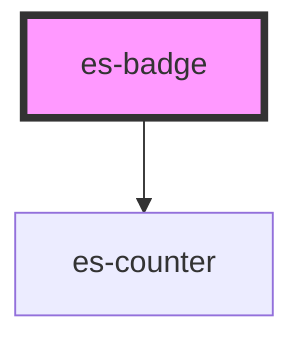

# es-badge

<!-- Auto Generated Below -->

## Properties

| Property             | Attribute   | Description                                                          | Type                                          | Default     |
| -------------------- | ----------- | -------------------------------------------------------------------- | --------------------------------------------- | ----------- |
| `color`              | `color`     | Choose the color variant of the badge                                | `"error" \| "okay" \| "warning"`              | `'error'`   |
| `count` _(required)_ | `count`     | What number to display in the counter (or if the dot should display) | `number`                                      | `undefined` |
| `showZero`           | `show-zero` | Show the dot and counter even if the count 0 (or negative)           | `boolean`                                     | `false`     |
| `size`               | `size`      | The base size (in px) of the counter (has no effect on the dot)      | `number \| undefined`                         | `undefined` |
| `variant`            | `variant`   | Select the display variant of the badge                              | `"dot" \| "filled" \| "minimal" \| "outline"` | `'filled'`  |

## CSS Custom Properties

| Name                       | Description                                                                       |
| -------------------------- | --------------------------------------------------------------------------------- |
| `--badge-background-color` | Background color of the badge. Can be set to a default via the color prop.        |
| `--badge-foreground-color` | Foreground (text) color of the badge. Can be set to a default via the color prop. |

## Dependencies

### Depends on

- [es-counter](../es-counter)

### Graph

----------------------------------------------

