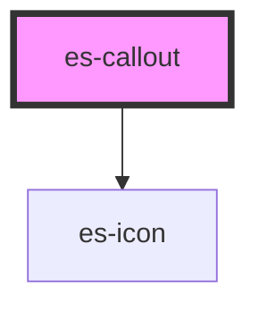

# es-callout

<!-- Auto Generated Below -->

## Properties

| Property               | Attribute | Description | Type                            | Default     |
| ---------------------- | --------- | ----------- | ------------------------------- | ----------- |
| `heading` _(required)_ | `heading` |             | `string`                        | `undefined` |
| `icon`                 | `icon`    |             | `string \| undefined`           | `undefined` |
| `variant`              | `variant` |             | `"error" \| "tip" \| "warning"` | `'tip'`     |

## Dependencies

### Depends on

- [es-icon](../es-icon)

### Graph

----------------------------------------------

*Built with [StencilJS](https://stenciljs.com/)*
