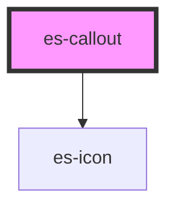

# es-callout


<!-- Auto Generated Below -->


## Overview

Calls out a piece of information.

## Usage

### Example

```tsx
import { randomIcon } from 'helpers';

export default () => (
    <>
        <es-callout variant={'tip'} heading={'Just the tip.'}>
            {'And only for a minute mind.'}
        </es-callout>
        <es-callout variant={'info'} heading={'For your information.'}>
            {'A cow-bison hybrid is called a beefalo.'}
        </es-callout>
        <es-callout variant={'warning'} heading={'Beware.'}>
            {'There is danger ahead.'}
        </es-callout>
        <es-callout variant={'error'} heading={'We have an error here.'}>
            {'Something has gone horribly wrong.'}
        </es-callout>
        <es-callout
            class={'custom'}
            icon={randomIcon()}
            heading={'I am custom.'}
        >
            {'Check the css tab to see the customisations'}
        </es-callout>
    </>
);
```

```css
.custom {
    --strong-color: yellow;
    --weak-color: #35363a;
    color: #dadce0;
    border-left-width: 5px;
}

.custom::part(heading) {
    font-style: italic;
}

.custom::part(icon) {
    border-radius: 0;
    border-width: 5px;
}
```


## Properties

| Property               | Attribute | Description                | Type                                                                 | Default     |
| ---------------------- | --------- | -------------------------- | -------------------------------------------------------------------- | ----------- |
| `heading` _(required)_ | `heading` | Heading text.              | `string`                                                             | `undefined` |
| `icon`                 | `icon`    | Override the variant icon. | `[namespace: string \| symbol, name: string] \| string \| undefined` | `undefined` |
| `variant`              | `variant` | Which color set to use.    | `"error" \| "info" \| "tip" \| "warning"`                            | `'tip'`     |


## Shadow Parts

| Part        | Description               |
| ----------- | ------------------------- |
| `"heading"` | Targets the heading text. |
| `"icon"`    | Targets the icon.         |


## CSS Custom Properties

| Name             | Description                                                                  |
| ---------------- | ---------------------------------------------------------------------------- |
| `--strong-color` | Header, icon and border color. Can be set to a default via the variant prop. |
| `--text-color`   | Color of the body text.                                                      |
| `--weak-color`   | Background color. Can be set to a default via the variant prop.              |


## Dependencies

### Depends on

- [es-icon](../es-icon)

### Graph


----------------------------------------------


