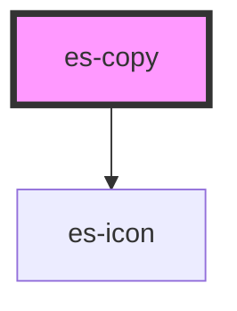

# es-copy


<!-- Auto Generated Below -->


## Usage

### Example

```tsx
export default () => (
    <es-copy>{'Click to copy this text to your clipboard.'}</es-copy>
);
```


## Methods

### `copy() => Promise<void>`


#### Returns

Type: `Promise<void>`


## Dependencies

### Depends on

- [es-icon](../es-icon)

### Graph


----------------------------------------------


