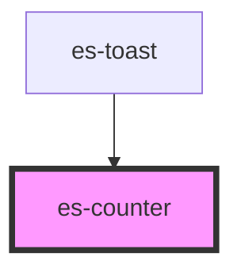

# es-counter

<!-- Auto Generated Below -->

## Properties

| Property  | Attribute | Description | Type                                 | Default    |
| --------- | --------- | ----------- | ------------------------------------ | ---------- |
| `count`   | `count`   |             | `number`                             | `0`        |
| `size`    | `size`    |             | `number`                             | `24`       |
| `variant` | `variant` |             | `"filled" \| "minimal" \| "outline"` | `'filled'` |

## Dependencies

### Used by

 - [es-toast](../toast/es-toast)

### Graph

----------------------------------------------

*Built with [StencilJS](https://stenciljs.com/)*
