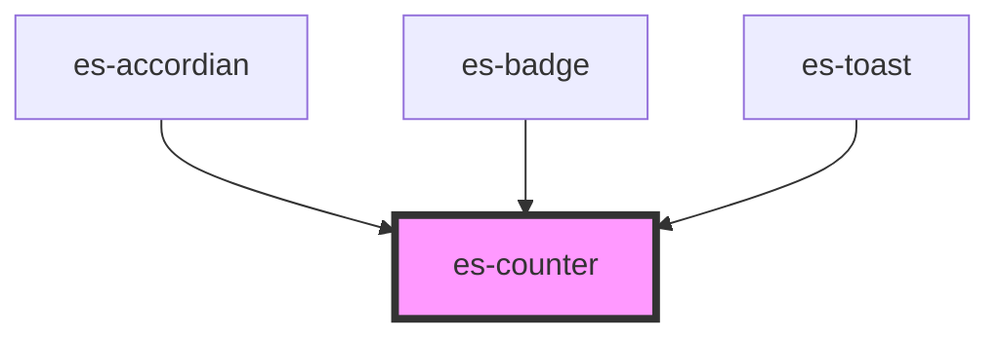

# es-counter


<!-- Auto Generated Below -->


## Usage

### Example

```tsx
import { createStore } from '@eventstore/stores';
import { random } from 'helpers';

const { state } = createStore(Array.from({ length: 144 }, () => random(800)));

setInterval(() => {
    const key = random(144);
    state[key] += 1;
}, 10);

const variant = ['filled', 'outline', 'minimal'];
const variants = Array.from({ length: 144 }, (_, i) => variant[random(3)]);

export default () =>
    variants.map((v, i) => <es-counter key={i} count={state[i]} variant={v} />);
```

```css
:host {
    display: grid;
    grid-template-columns: repeat(12, minmax(12px, 1fr));
    gap: 10px;
    align-items: center;
    justify-items: center;
    justify-content: center;
    align-content: center;
    --background-color: white;
}
```


## Properties

| Property  | Attribute | Description                                                          | Type                                 | Default    |
| --------- | --------- | -------------------------------------------------------------------- | ------------------------------------ | ---------- |
| `count`   | `count`   | The number to display                                                | `number`                             | `0`        |
| `size`    | `size`    | The height of the counter that the rest of the dimensions scale from | `number`                             | `24`       |
| `variant` | `variant` | The display style of the counter.                                    | `"filled" \| "minimal" \| "outline"` | `'filled'` |


## CSS Custom Properties

| Name                    | Description                                                                                 |
| ----------------------- | ------------------------------------------------------------------------------------------- |
| `--background-color`    | Defaults to --color-secondary. The forground color. Named to imherit colors from es-button. |
| `--text-color`          | Defaults to --color-text. The background color. Named to imherit colors from es-button.     |
| `--transition-duration` | Duration of the pulse. Defaults to 300ms.                                                   |


## Dependencies

### Used by

 - [es-accordian](../es-accordian)
 - [es-badge](../es-badge)
 - es-toast

### Graph


----------------------------------------------


