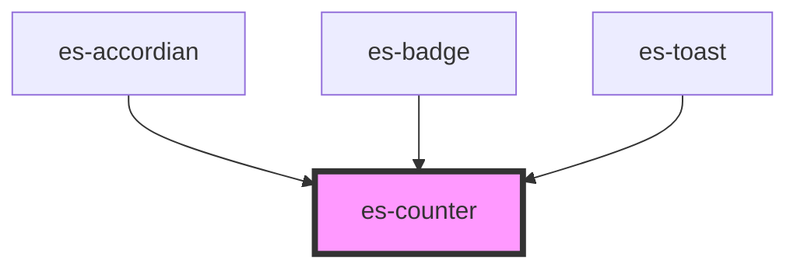

# es-counter

<!-- Auto Generated Below -->


## Overview

A pill display of an number, that pulses on change. Caps out at 999.

## Usage

### Example

```tsx
import { createStore } from '@eventstore-ui/stores';
import { random } from 'utils/helpers';

const { state } = createStore(Array.from({ length: 144 }, () => random(800)));

setInterval(() => {
    const key = random(144);
    state[key] += 1;
}, 10);

const variant = ['filled', 'outline', 'minimal'] as const;
const variants = Array.from({ length: 144 }, () => variant[random(2)]);

export default () =>
    variants.map((v, i) => <es-counter key={i} count={state[i]} variant={v} />);
```

```css
:host {
    display: grid;
    grid-template-columns: repeat(12, minmax(12px, 1fr));
    gap: 10px;
    align-items: center;
    justify-items: center;
    justify-content: center;
    align-content: center;
}
```


## Properties

| Property  | Attribute | Description                                                          | Type                                          | Default     |
| --------- | --------- | -------------------------------------------------------------------- | --------------------------------------------- | ----------- |
| `color`   | `color`   | Choose the color variant of the counter                              | `"error" \| "okay" \| "warning" \| undefined` | `undefined` |
| `count`   | `count`   | The number to display                                                | `number`                                      | `0`         |
| `size`    | `size`    | The height of the counter that the rest of the dimensions scale from | `number`                                      | `24`        |
| `variant` | `variant` | The display style of the counter.                                    | `"filled" \| "minimal" \| "outline"`          | `'filled'`  |


## CSS Custom Properties

| Name                         | Description                                                                                                    |
| ---------------------------- | -------------------------------------------------------------------------------------------------------------- |
| `--counter-background-color` | The background color. Defaults to --foreground-color. Inverts the parent foreground / background relationship. |
| `--counter-foreground-color` | The foreground color. Defaults to --background-color. Inverts the parent foreground / background relationship. |
| `--transition-duration`      | Duration of the pulse. Defaults to 300ms.                                                                      |


## Dependencies

### Used by

 - [es-accordian](../es-accordian)
 - [es-badge](../es-badge)
 - es-toast

### Graph


----------------------------------------------


