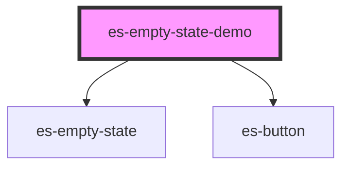

# es-empty-state


<!-- Auto Generated Below -->


## Overview

Basic es-empty-state demo

## Usage

### Example

```tsx

export default () =>
<div>
    <es-empty-state header={'Example empty state'} body={<es-button>{'There are no items'}</es-button>}>
    <p slot='illustration'>{'Illustration here'}</p>
    <p slot='foot'>{ 'Footer goes here' }</p>
    </es-empty-state>
    <hr/>
    <es-empty-state header={'Example empty state'} body={'No items to show'} layout='horizontal'>
    <p slot='illustration'>{ 'Illustration here' }</p>
    <p slot='foot'>{ 'Footer goes here' }</p>
    </es-empty-state>
</div>
        
```


## Dependencies

### Depends on

- [es-empty-state](.)
- [es-button](../buttons/es-button)

### Graph


----------------------------------------------


