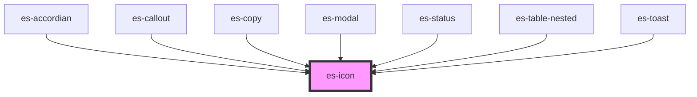

# es-icon

<!-- Auto Generated Below -->

## Properties

| Property            | Attribute        | Description | Type                             | Default       |
| ------------------- | ---------------- | ----------- | -------------------------------- | ------------- |
| `angle`             | `angle`          |             | `number`                         | `0`           |
| `icon` _(required)_ | `icon`           |             | `string`                         | `undefined`   |
| `size`              | `size`           |             | `number`                         | `24`          |
| `spin`              | `spin`           |             | `boolean \| undefined`           | `undefined`   |
| `spinDirection`     | `spin-direction` |             | `"antiClockwise" \| "clockwise"` | `'clockwise'` |

## Methods

### `spinEnd() => Promise<void>`

#### Returns

Type: `Promise<void>`

## Dependencies

### Used by

 - [es-accordian](../es-accordian)
 - [es-callout](../es-callout)
 - [es-copy](../es-copy)
 - [es-modal](../es-modal)
 - [es-status](../es-status)
 - [es-table-nested](../es-table-nested)
 - [es-toast](../toast/es-toast)

### Graph

----------------------------------------------

