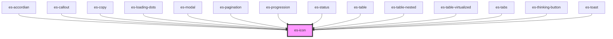

# es-icon

<!-- Auto Generated Below -->


## Overview

Displays an icon loaded from the `iconStore`. An icon named "spinner" will automatically spin.
See [IconStore](/components/variables/iconStore) for details on how to load icons.

## Usage

### Example

```tsx
import { icons } from 'utils/helpers';

export default () =>
    icons.map((icon) => <es-icon key={icon} icon={icon} title={icon} />);
```

```css
:host {
    display: grid;
    grid-template-columns: repeat(12, minmax(12px, 1fr));
    gap: 10px;
    align-items: center;
    justify-items: center;
    justify-content: center;
    align-content: center;
}
```


## Properties

| Property            | Attribute        | Description                                               | Type                                                    | Default       |
| ------------------- | ---------------- | --------------------------------------------------------- | ------------------------------------------------------- | ------------- |
| `angle`             | `angle`          | Rotate the icon to a speciied angle.                      | `number`                                                | `0`           |
| `icon` _(required)_ | `icon`           | Which icon to display.                                    | `[namespace: string \| symbol, name: string] \| string` | `undefined`   |
| `size`              | `size`           | The hight and width to scale the icon to.                 | `number`                                                | `24`          |
| `spin`              | `spin`           | Apply a spin animation.                                   | `boolean \| undefined`                                  | `undefined`   |
| `spinDirection`     | `spin-direction` | When spinning, should it spin clockwise or anticlockwise. | `"antiClockwise" \| "clockwise"`                        | `'clockwise'` |


## Methods

### `spinEnd() => Promise<void>`

Provides a promise that resolves at the end of a single spin, if the icon is spinning.

#### Returns

Type: `Promise<void>`


## Shadow Parts

| Part     | Description        |
| -------- | ------------------ |
| `"icon"` | The internal icon. |


## Dependencies

### Used by

 - [es-accordian](../es-accordian)
 - [es-callout](../es-callout)
 - [es-copy](../es-copy)
 - [es-loading-dots](../es-loading-dots)
 - [es-modal](../es-modal)
 - [es-pagination](../es-pagination)
 - [es-progression](../es-progression)
 - es-status
 - [es-table](../tables/es-table)
 - [es-table-nested](../tables/es-table-nested)
 - [es-table-virtualized](../tables/es-table-virtualized)
 - [es-tabs](../es-tabs)
 - [es-thinking-button](../es-thinking-button)
 - es-toast

### Graph


----------------------------------------------


