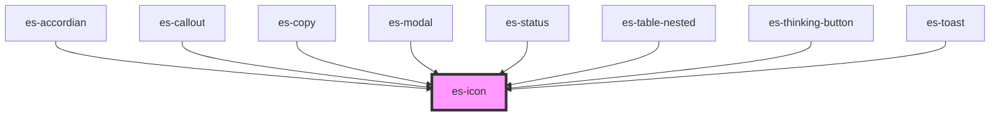

# es-icon


<!-- Auto Generated Below -->


## Usage

### Example

```tsx
import { icons } from 'helpers';

export default () =>
    icons.map((icon) => <es-icon key={icon} icon={icon} title={icon} />);
```

```css
:host {
    display: grid;
    grid-template-columns: repeat(12, minmax(12px, 1fr));
    gap: 10px;
    align-items: center;
    justify-items: center;
    justify-content: center;
    align-content: center;
}
```


## Properties

| Property            | Attribute        | Description                                               | Type                             | Default       |
| ------------------- | ---------------- | --------------------------------------------------------- | -------------------------------- | ------------- |
| `angle`             | `angle`          | Rotate the icon to a speciied angle.                      | `number`                         | `0`           |
| `icon` _(required)_ | `icon`           | Which icon to display.                                    | `string`                         | `undefined`   |
| `size`              | `size`           | The hight and width to scale the icon to.                 | `number`                         | `24`          |
| `spin`              | `spin`           | Apply a spin animation.                                   | `boolean \| undefined`           | `undefined`   |
| `spinDirection`     | `spin-direction` | When spinning, should it spin clockwise or anticlockwise. | `"antiClockwise" \| "clockwise"` | `'clockwise'` |


## Methods

### `spinEnd() => Promise<void>`

Provides a promise that resolves at the end of a single spin, if the icon is spinning.

#### Returns

Type: `Promise<void>`


## Dependencies

### Used by

 - [es-accordian](../es-accordian)
 - [es-callout](../es-callout)
 - [es-copy](../es-copy)
 - [es-modal](../es-modal)
 - [es-status](../es-status)
 - [es-table-nested](../es-table-nested)
 - [es-thinking-button](../es-thinking-button)
 - [es-toast](../toast/es-toast)

### Graph


----------------------------------------------


