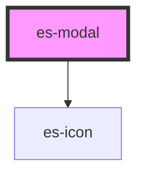

# es-portal

<!-- Auto Generated Below -->

## Properties

| Property | Attribute | Description | Type      | Default |
| -------- | --------- | ----------- | --------- | ------- |
| `footer` | `footer`  |             | `boolean` | `true`  |
| `header` | `header`  |             | `boolean` | `true`  |

## Events

| Event          | Description | Type               |
| -------------- | ----------- | ------------------ |
| `requestClose` |             | `CustomEvent<any>` |

## Dependencies

### Depends on

- [es-icon](../es-icon)

### Graph

----------------------------------------------

