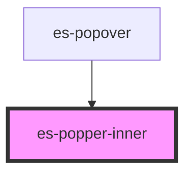

# es-popper-inner

<!-- Auto Generated Below -->

## Methods

### `setPosition(position: Position) => Promise<void>`

#### Returns

Type: `Promise<void>`

## Dependencies

### Used by

 - [es-popover](../..)

### Graph

----------------------------------------------

*Built with [StencilJS](https://stenciljs.com/)*
