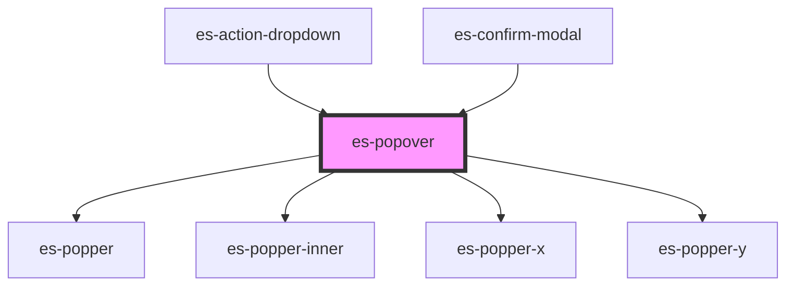

# es-popper-inner

<!-- Auto Generated Below -->


## Overview

Attaches a portaled popover, attached to the parent node. Can be used to create dropdowns, tooltips etc. The parent scoped shadow styles are copied to the created portals shadow styles, to allow styling popover contents externally.

## Usage

### Example

```tsx
import { createStore } from '@eventstore-ui/stores';
import type { FieldChange } from '@eventstore-ui/fields';

interface PopoverStore {
    open: boolean;
    arrow: boolean;
    autoSize: HTMLEsPopoverElement['autoSize'];
    constrain: HTMLEsPopoverElement['constrain'];
    placement: HTMLEsPopoverElement['placement'];
    offset: number;
}

const { state } = createStore<PopoverStore>({
    open: true,
    arrow: true,
    autoSize: 'none',
    constrain: 'none',
    placement: 'top',
    offset: 16,
});

export default () => (
    <>
        <div class={'options'}>
            <f2-checkbox
                name={'open'}
                value={state.open}
                onFieldchange={fieldChange}
            >
                {'Open'}
            </f2-checkbox>
            <f2-checkbox
                name={'arrow'}
                value={state.arrow}
                onFieldchange={fieldChange}
            >
                {'Arrow'}
            </f2-checkbox>
            <f2-select-field
                name={'autoSize'}
                label={'autoSize'}
                options={constrainOptions}
                value={state.autoSize}
                onFieldchange={fieldChange}
            />
            <f2-select-field
                name={'constrain'}
                label={'constrain'}
                options={constrainOptions}
                value={state.constrain}
                onFieldchange={fieldChange}
            />
            <f2-select-field
                name={'placement'}
                label={'placement'}
                options={placement}
                value={state.placement}
                onFieldchange={fieldChange}
            />
            <f2-number-field
                label={'offset'}
                placeholder={'How much offset'}
                unit={'px'}
                name={'offset'}
                value={state.offset.toString()}
                onFieldchange={fieldChange}
            />
        </div>
        <div class={'wrapper'}>
            <div class={'attachment'}>
                {'Attachment element'}
                <es-popover
                    open={state.open}
                    arrow={state.arrow}
                    autoSize={state.autoSize}
                    constrain={state.constrain}
                    placement={state.placement}
                    offset={state.offset}
                >
                    <div class={'popper'}>{'popover'}</div>
                </es-popover>
            </div>
        </div>
    </>
);

const fieldChange = (e: CustomEvent<FieldChange<unknown>>) => {
    const { name, value } = e.detail;
    // dont do this
    (state as any)[name] = value;
};

const constrainOptions = [
    { value: 'none', name: 'none' },
    { value: 'width', name: 'width' },
    { value: 'height', name: 'height' },
    { value: 'both', name: 'both' },
];

const placement = [
    { value: 'top', name: 'top' },
    { value: 'top-start', name: 'top-start' },
    { value: 'top-end', name: 'top-end' },
    { value: 'right', name: 'right' },
    { value: 'right-start', name: 'right-start' },
    { value: 'right-end', name: 'right-end' },
    { value: 'bottom', name: 'bottom' },
    { value: 'bottom-start', name: 'bottom-start' },
    { value: 'bottom-end', name: 'bottom-end' },
    { value: 'left', name: 'left' },
    { value: 'left-start', name: 'left-start' },
    { value: 'left-end', name: 'left-end' },
];
```

```css
:host {
    display: flex;
    align-items: flex-start;
    width: 100%;
    padding: 0;
}

.wrapper {
    flex: 1 1 100%;
    display: flex;
    align-items: center;
    justify-content: center;
    height: 100vh;
}

.attachment {
    background-color: orange;
    padding: 20px;
    display: flex;
    align-items: center;
}

.inner {
    opacity: 0;
    transition: opacity 400ms ease;
    background-color: skyblue;
    box-shadow: none;
    position: relative;
    padding: 10px;
    display: flex;
    align-items: center;
    justify-content: center;
}

.inner.entered {
    opacity: 1;
}

.arrow::after {
    background-color: red;
}

.options {
    width: 300px;
    border: 1px solid var(--color-shade-30);
    padding: 10px;
    border-radius: 20px;
    justify-self: flex-end;
    height: 100vh;
}
```


## Properties

| Property              | Attribute                | Description                                                                            | Type                                                                                                                                                                 | Default     |
| --------------------- | ------------------------ | -------------------------------------------------------------------------------------- | -------------------------------------------------------------------------------------------------------------------------------------------------------------------- | ----------- |
| `arrow`               | `arrow`                  | If the popover should render an arrow.                                                 | `boolean`                                                                                                                                                            | `false`     |
| `attachTo`            | --                       | Pass an element to attach the popover to. (Defaults to the parent element.)            | `HTMLElement \| undefined`                                                                                                                                           | `undefined` |
| `autoSize`            | `auto-size`              | Constrain the size of the popover to the size of the attachment node.                  | `"both" \| "height" \| "none" \| "width"`                                                                                                                            | `'none'`    |
| `backdrop`            | `backdrop`               | If the popover should overlay a backdrop, to prevent external clicks.                  | `boolean`                                                                                                                                                            | `false`     |
| `closeOnBlur`         | `close-on-blur`          | If the popover should request to close when focus is lost                              | `boolean`                                                                                                                                                            | `false`     |
| `closeOnClickOutside` | `close-on-click-outside` | If the popover should request to close when clicked outside                            | `boolean`                                                                                                                                                            | `false`     |
| `closeOnEsc`          | `close-on-esc`           | If the popover should request to close when esc is pressed                             | `boolean`                                                                                                                                                            | `false`     |
| `closeOnScrollEscape` | `close-on-scroll-escape` | If the popover should request to close when the attachment element scrolls out of view | `boolean`                                                                                                                                                            | `false`     |
| `constrain`           | `constrain`              | Constrain the size of the popover inner to the size of the window.                     | `"both" \| "height" \| "none" \| "width"`                                                                                                                            | `'height'`  |
| `flip`                | `flip`                   | An array of allowed placements or enable / disable                                     | `Placement[] \| boolean \| undefined`                                                                                                                                | `true`      |
| `hideOnScrollEscape`  | `hide-on-scroll-escape`  | If the popover should hide itself when the attachment element scrolls out of view      | `boolean`                                                                                                                                                            | `true`      |
| `maxHeight`           | `max-height`             | The maximum height to constrain to.                                                    | `number`                                                                                                                                                             | `Infinity`  |
| `maxWidth`            | `max-width`              | The maximum width to constrain to.                                                     | `number`                                                                                                                                                             | `Infinity`  |
| `offset`              | `offset`                 | The offset away from the attachement element in px.                                    | `number`                                                                                                                                                             | `0`         |
| `open`                | `open`                   | Toggles if the popover is open or not.                                                 | `boolean`                                                                                                                                                            | `false`     |
| `placement`           | `placement`              | Where to place the popover in relation to the attachment point.                        | `"bottom" \| "bottom-end" \| "bottom-start" \| "left" \| "left-end" \| "left-start" \| "right" \| "right-end" \| "right-start" \| "top" \| "top-end" \| "top-start"` | `'top'`     |
| `popperClass`         | `popper-class`           | Class name for the popper                                                              | `string \| undefined`                                                                                                                                                | `undefined` |
| `target`              | `target`                 | A query selecter to select the element to portal the popper to.                        | `string`                                                                                                                                                             | `'body'`    |
| `trapFocus`           | `trap-focus`             | If the popover should trap focus within, and return focus on close.                    | `boolean`                                                                                                                                                            | `false`     |
| `zIndex`              | `z-index`                | What zIndex to place the popover in.                                                   | `number \| undefined`                                                                                                                                                | `undefined` |


## Events

| Event          | Description                                  | Type               |
| -------------- | -------------------------------------------- | ------------------ |
| `requestClose` | Triggers when the popover requests to close. | `CustomEvent<any>` |


## Dependencies

### Used by

 - [es-action-dropdown](../actions/es-action-dropdown)
 - [es-confirm-modal](../modals/es-confirm-modal)

### Depends on

- es-popper
- es-popper-inner
- es-popper-x
- es-popper-y

### Graph


----------------------------------------------


