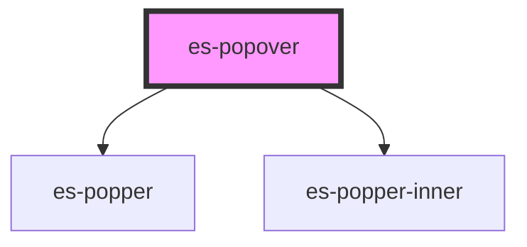

# es-popper-inner

<!-- Auto Generated Below -->

## Properties

| Property      | Attribute      | Description | Type                                      | Default     |
| ------------- | -------------- | ----------- | ----------------------------------------- | ----------- |
| `attachTo`    | --             |             | `HTMLElement \| undefined`                | `undefined` |
| `attachmentX` | `attachment-x` |             | `"left" \| "middle" \| "right"`           | `'middle'`  |
| `attachmentY` | `attachment-y` |             | `"bottom" \| "middle" \| "top"`           | `'bottom'`  |
| `backdrop`    | `backdrop`     |             | `boolean`                                 | `false`     |
| `constrain`   | `constrain`    |             | `"both" \| "height" \| "none" \| "width"` | `'none'`    |
| `offsetX`     | `offset-x`     |             | `number`                                  | `0`         |
| `offsetY`     | `offset-y`     |             | `number`                                  | `0`         |
| `open`        | `open`         |             | `boolean`                                 | `false`     |
| `popperClass` | `popper-class` |             | `string \| undefined`                     | `undefined` |
| `positionX`   | `position-x`   |             | `"left" \| "middle" \| "right"`           | `'middle'`  |
| `positionY`   | `position-y`   |             | `"bottom" \| "middle" \| "top"`           | `'top'`     |
| `target`      | `target`       |             | `string`                                  | `'body'`    |
| `trapFocus`   | `trap-focus`   |             | `boolean`                                 | `false`     |

## Events

| Event          | Description | Type               |
| -------------- | ----------- | ------------------ |
| `requestClose` |             | `CustomEvent<any>` |

## Dependencies

### Depends on

- [es-popper](./components/es-popper)
- [es-popper-inner](./components/es-popper-inner)

### Graph

----------------------------------------------

