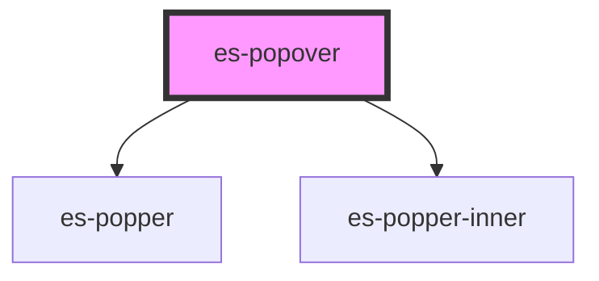

# es-popper-inner


<!-- Auto Generated Below -->


## Usage

### Example

```tsx
import { createStore } from '@eventstore/stores';
import { debounce } from '@eventstore/utils';

interface PopoverStore {
    open: boolean;
    constrain: HTMLESPopoverElement['constrain'];
    positionY: HTMLESPopoverElement['positionY'];
    positionX: HTMLESPopoverElement['positionX'];
    attachmentY: HTMLESPopoverElement['attachmentY'];
    attachmentX: HTMLESPopoverElement['attachmentX'];
    offsetY: number;
    offsetX: number;
}

const { state } = createStore<PopoverStore>({
    open: true,
    constrain: 'none',
    positionY: 'top',
    positionX: 'right',
    attachmentY: 'bottom',
    attachmentX: 'left',
    offsetY: 0,
    offsetX: 0,
});

export default () => (
    <>
        <div class={'options'}>
            <es-checkbox
                name={'open'}
                value={state.open}
                onFieldchange={fieldChange}
            >
                {'Open'}
            </es-checkbox>
            <es-select
                name={'constrain'}
                label={'constrain'}
                options={constrainOptions}
                value={state.constrain}
                onFieldchange={fieldChange}
            />
            <es-select
                name={'positionY'}
                label={'positionY'}
                options={yLocations}
                value={state.positionY}
                onFieldchange={fieldChange}
            />
            <es-select
                name={'positionX'}
                label={'positionX'}
                options={xLocations}
                value={state.positionX}
                onFieldchange={fieldChange}
            />
            <es-select
                name={'attachmentY'}
                label={'attachmentY'}
                options={yLocations}
                value={state.attachmentY}
                onFieldchange={fieldChange}
            />
            <es-select
                name={'attachmentX'}
                label={'attachmentX'}
                options={xLocations}
                value={state.attachmentX}
                onFieldchange={fieldChange}
            />
            <es-number-input
                label={'offsetY'}
                unit={'px'}
                name={'offsetY'}
                value={state.offsetY}
                onFieldchange={fieldChange}
            />
            <es-number-input
                label={'offsetX'}
                unit={'px'}
                name={'offsetX'}
                value={state.offsetX}
                onFieldchange={fieldChange}
            />
        </div>
        <div class={'wrapper'}>
            <div class={'attachment'}>
                {'Attachment element'}
                <es-popover
                    open={state.open}
                    constrain={state.constrain}
                    positionY={state.positionY}
                    positionX={state.positionX}
                    attachmentY={state.attachmentY}
                    attachmentX={state.attachmentX}
                    offsetY={state.offsetY}
                    offsetX={state.offsetX}
                >
                    <div class={'popper'}>{'popover'}</div>
                </es-popover>
            </div>
        </div>
    </>
);

const fieldChange = (e) => {
    const { name, value } = e.detail;
    state[name] = value;
};

const constrainOptions = [
    { value: 'none', name: 'none' },
    { value: 'width', name: 'width' },
    { value: 'height', name: 'height' },
    { value: 'both', name: 'both' },
];

const yLocations = [
    { value: 'top', name: 'top' },
    { value: 'middle', name: 'middle' },
    { value: 'bottom', name: 'bottom' },
];

const xLocations = [
    { value: 'right', name: 'right' },
    { value: 'middle', name: 'middle' },
    { value: 'left', name: 'left' },
];
```

```css
:host {
    display: flex;
    align-items: flex-start;
    width: 100%;
    padding: 0;
}

.wrapper {
    flex: 1 1 100%;
    display: flex;
    align-items: center;
    justify-content: center;
    height: 100%;
}

.attachment {
    background-color: orange;
    padding: 20px;
    display: flex;
    align-items: center;
}

.inner {
    width: 100%;
    height: 100%;
}

.popper {
    background-color: skyblue;
    width: 100%;
    height: 100%;
    padding: 5px;
}

.options {
    width: 300px;
    border: 1px solid var(--color-grey-200);
    padding: 10px;
    border-radius: 20px;
    justify-self: flex-end;
    height: 100vh;
}

es-select,
es-number-input {
    --field-grid-columns: [before] 100px [input] 150px [after] 0px;
}

es-checkbox {
    --field-grid-columns: [before] 100px [input] 24px [label] 1fr [after] 0;
}
```


## Properties

| Property      | Attribute      | Description                                                                 | Type                                      | Default     |
| ------------- | -------------- | --------------------------------------------------------------------------- | ----------------------------------------- | ----------- |
| `attachTo`    | --             | Pass an element to attach the popover to. (Defaults to the parent element.) | `HTMLElement \| undefined`                | `undefined` |
| `attachmentX` | `attachment-x` | The Y axis attachment location.                                             | `"left" \| "middle" \| "right"`           | `'middle'`  |
| `attachmentY` | `attachment-y` | The Y axis attachment location.                                             | `"bottom" \| "middle" \| "top"`           | `'bottom'`  |
| `backdrop`    | `backdrop`     | If the popover should overlay a backdrop, to prevent external clicks.       | `boolean`                                 | `false`     |
| `constrain`   | `constrain`    | Constrain the size of the popover to the size of the attachment node.       | `"both" \| "height" \| "none" \| "width"` | `'none'`    |
| `offsetX`     | `offset-x`     | The offset the X axis in pixels.                                            | `number`                                  | `0`         |
| `offsetY`     | `offset-y`     | The offset the Y axis in pixels.                                            | `number`                                  | `0`         |
| `open`        | `open`         | Toggles if the popover is open or not.                                      | `boolean`                                 | `false`     |
| `popperClass` | `popper-class` | Class name for the popper                                                   | `string \| undefined`                     | `undefined` |
| `positionX`   | `position-x`   | The X axis positioning location.                                            | `"left" \| "middle" \| "right"`           | `'middle'`  |
| `positionY`   | `position-y`   | The Y axis positioning location.                                            | `"bottom" \| "middle" \| "top"`           | `'top'`     |
| `target`      | `target`       | A query selecter to select the element to portal the popper to.             | `string`                                  | `'body'`    |
| `trapFocus`   | `trap-focus`   | If the popover should trap focus within, and return focus on close.         | `boolean`                                 | `false`     |


## Events

| Event          | Description                                  | Type               |
| -------------- | -------------------------------------------- | ------------------ |
| `requestClose` | Triggers when the popover requests to close. | `CustomEvent<any>` |


## Dependencies

### Depends on

- es-popper
- es-popper-inner

### Graph


----------------------------------------------


