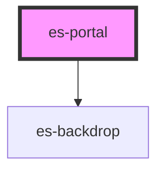

# es-portal

<!-- Auto Generated Below -->

## Properties

| Property               | Attribute  | Description | Type      | Default     |
| ---------------------- | ---------- | ----------- | --------- | ----------- |
| `backdrop`             | `backdrop` |             | `boolean` | `false`     |
| `element` _(required)_ | --         |             | `VNode`   | `undefined` |
| `open`                 | `open`     |             | `boolean` | `false`     |
| `target`               | `target`   |             | `string`  | `'body'`    |

## Events

| Event          | Description | Type               |
| -------------- | ----------- | ------------------ |
| `requestClose` |             | `CustomEvent<any>` |

## Methods

### `attachElement() => Promise<void>`

#### Returns

Type: `Promise<void>`

### `detatchElement() => Promise<void>`

#### Returns

Type: `Promise<void>`

## Dependencies

### Depends on

- [es-backdrop](../es-backdrop)

### Graph

----------------------------------------------

