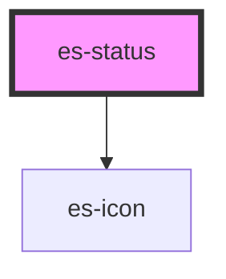

# es-status

<!-- Auto Generated Below -->

## Properties

| Property              | Attribute | Description | Type                                 | Default     |
| --------------------- | --------- | ----------- | ------------------------------------ | ----------- |
| `status` _(required)_ | `status`  |             | `"critical" \| "degraded" \| "okay"` | `undefined` |

## Dependencies

### Depends on

- [es-icon](../es-icon)

### Graph

----------------------------------------------

