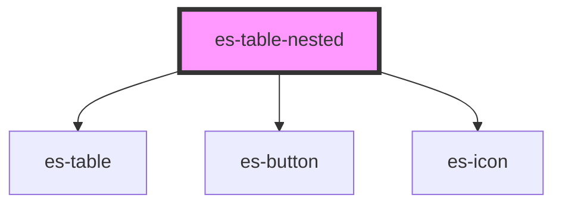

# es-table-nested

<!-- Auto Generated Below -->

## Properties

| Property              | Attribute                | Description | Type                                                           | Default           |
| --------------------- | ------------------------ | ----------- | -------------------------------------------------------------- | ----------------- |
| `activePath`          | --                       |             | `string[] \| undefined`                                        | `undefined`       |
| `canExpand`           | --                       |             | `(key: string, data: any) => boolean`                          | `() => true`      |
| `cells` _(required)_  | --                       |             | `{ [x: string]: TableCell<any>; }`                             | `undefined`       |
| `columns`             | --                       |             | `string[] \| undefined`                                        | `undefined`       |
| `getCellData`         | --                       |             | `((key: string) => any) \| undefined`                          | `undefined`       |
| `getNestedCellData`   | --                       |             | `((key: string) => any) \| undefined`                          | `undefined`       |
| `getNestedRows`       | --                       |             | `((key: string) => string[] \| undefined) \| undefined`        | `undefined`       |
| `linkRowTo`           | --                       |             | `((row: any) => string) \| undefined`                          | `undefined`       |
| `loadNested`          | --                       |             | `((key: string, data: any) => Promise<void>) \| undefined`     | `undefined`       |
| `nestedColumns`       | --                       |             | `string[] \| undefined`                                        | `undefined`       |
| `nestedIdentifier`    | `nested-identifier`      |             | `string`                                                       | `'nested-table'`  |
| `nestedRowTakesFocus` | `nested-row-takes-focus` |             | `boolean \| undefined`                                         | `undefined`       |
| `outerIdentifier`     | `outer-identifier`       |             | `string`                                                       | `'table'`         |
| `rowClass`            | --                       |             | `(row: any) => string \| Record<string, boolean> \| undefined` | `() => undefined` |
| `rowTakesFocus`       | `row-takes-focus`        |             | `boolean \| undefined`                                         | `undefined`       |
| `rows` _(required)_   | --                       |             | `string[]`                                                     | `undefined`       |

## Events

| Event       | Description | Type                                       |
| ----------- | ----------- | ------------------------------------------ |
| `clickRow`  |             | `CustomEvent<any>`                         |
| `expansion` |             | `CustomEvent<{ data: any; key: string; }>` |

## Dependencies

### Depends on

- [es-table](../es-table)
- [es-button](../buttons/es-button)
- [es-icon](../es-icon)

### Graph

----------------------------------------------

