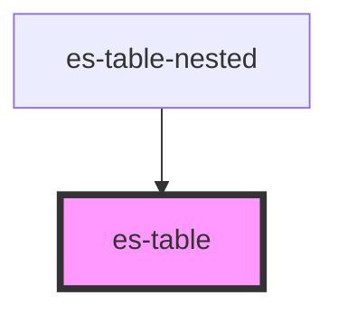

# es-table

<!-- Auto Generated Below -->

## Properties

| Property             | Attribute         | Description | Type                                                           | Default           |
| -------------------- | ----------------- | ----------- | -------------------------------------------------------------- | ----------------- |
| `cells` _(required)_ | --                |             | `{ [x: string]: TableCell<any>; }`                             | `undefined`       |
| `columns`            | --                |             | `string[] \| undefined`                                        | `undefined`       |
| `getCellData`        | --                |             | `<T = string>(key: T) => any`                                  | `(d) => d`        |
| `headless`           | `headless`        |             | `boolean`                                                      | `false`           |
| `identifier`         | `identifier`      |             | `string`                                                       | `'table'`         |
| `linkRowTo`          | --                |             | `((row: any) => string) \| undefined`                          | `undefined`       |
| `renderExpansion`    | --                |             | `(key: string) => VNode \| null`                               | `() => null`      |
| `rowClass`           | --                |             | `(row: any) => string \| Record<string, boolean> \| undefined` | `() => undefined` |
| `rowTakesFocus`      | `row-takes-focus` |             | `boolean \| undefined`                                         | `undefined`       |
| `rows` _(required)_  | --                |             | `any[]`                                                        | `undefined`       |

## Events

| Event      | Description | Type               |
| ---------- | ----------- | ------------------ |
| `clickRow` |             | `CustomEvent<any>` |

## Dependencies

### Used by

 - [es-table-nested](../es-table-nested)

### Graph

----------------------------------------------

