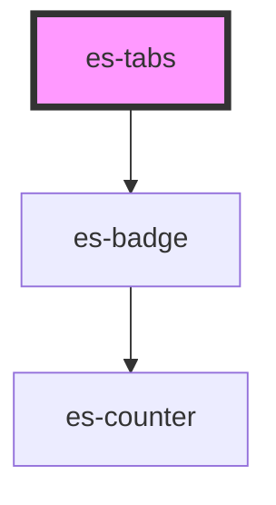

# es-tabs


<!-- Auto Generated Below -->


## Usage

### Example

```tsx
import { Tab } from '@eventstore/components';

const tabs: Tab[] = [
    {
        id: 'tab-1',
        title: 'One',
    },
    {
        id: 'tab-2',
        title: 'Two',
        badge: () => true,
    },
    {
        id: 'tab-3',
        title: 'Three',
    },
    {
        id: 'tab-4',
        title: 'Four',
    },
];

export default () => (
    <es-tabs tabs={tabs} activeParam={false}>
        <p slot={'tab-1'}>{'I am in tab 1'}</p>
        <p slot={'tab-2'}>{'Welcome to tab 2!'}</p>
        <p slot={'tab-3'}>{'Hello 👋. You have reached tab 3.'}</p>
        <es-input slot={'tab-4'} value={'Hello'} label={'My Field'} />
        <es-input
            slot={'tab-4'}
            value={'Welcome to tab four'}
            label={'Our Field'}
        />
    </es-tabs>
);
```


## Properties

| Property            | Attribute      | Description                                                                                        | Type                  | Default     |
| ------------------- | -------------- | -------------------------------------------------------------------------------------------------- | --------------------- | ----------- |
| `active`            | `active`       | The currently active panel. By default it will take from the passed activeParam, or the first tab. | `string \| undefined` | `undefined` |
| `activeParam`       | `active-param` | Reflect the active tab to a search param of name. Set to false to disable.                         | `boolean \| string`   | `'tab'`     |
| `tabs` _(required)_ | --             | A list of tabs.                                                                                    | `Tab[]`               | `undefined` |


## Events

| Event       | Description                                                                 | Type                  |
| ----------- | --------------------------------------------------------------------------- | --------------------- |
| `tabChange` | Triggered when the active tab is changed. `detail` is the newly active tab. | `CustomEvent<string>` |


## Slots

| Slot          | Description                                                  |
| ------------- | ------------------------------------------------------------ |
| `"[tabName]"` | Slots are created based off of the names of the passed tabs. |


## Shadow Parts

| Part          | Description                 |
| ------------- | --------------------------- |
| `"indicator"` | The sliding indicatior bar. |
| `"panel"`     | Tab panels.                 |
| `"tab"`       | Tabs.                       |
| `"tablist"`   | The tab container.          |


## CSS Custom Properties

| Name                      | Description                                                          |
| ------------------------- | -------------------------------------------------------------------- |
| `--active-color`          | The active text color of the tab, and color of the active indicator; |
| `--border-color`          | The color of border surrounding the tab content;                     |
| `--focus-color`           | The focused text color of the tab;                                   |
| `--focus-indicator-color` | The color of the focus indicator;                                    |
| `--inactive-color`        | The inactive text color of the tab;                                  |


## Dependencies

### Depends on

- [es-badge](../es-badge)

### Graph


----------------------------------------------


