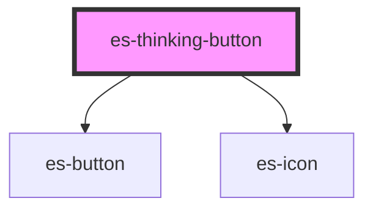

# es-thinking-button


<!-- Auto Generated Below -->


## Usage

### Example

```tsx
import { random, delay } from 'helpers';
import { toast } from '@eventstore/components';

type CoinToss = 'heads' | 'tails';

const play = (user: Hand) => async () => {
    toast.info({
        title: 'The coin is tossed!',
        message: `User calls ${user}.`,
        icon: user,
        duration: 2000,
    });

    // flip the coin
    await delay(2000);

    const result: CoinToss = random(1) ? 'heads' : 'tails';

    if (user === result) {
        toast.success({
            title: `The coin lands ${result} side up!`,
            message: 'The user wins',
            icon: result,
            duration: 2000,
        });
        return true;
    }

    toast.error({
        title: `The coin lands ${result} side up!`,
        message: 'The user loses',
        icon: result,
        duration: 2000,
    });

    throw new Error('You lose.');
};

export default () => (
    <>
        <es-thinking-button
            text={'Heads'}
            defaultIcon={'heads'}
            action={play('heads')}
        />
        <es-thinking-button
            text={'Tails'}
            defaultIcon={'tails'}
            action={play('tails')}
        />
    </>
);
```

```css
:host {
    display: flex;
    align-items: center;
    justify-content: center;
}
```


## Properties

| Property                   | Attribute       | Description                                                                                                     | Type                                                                                | Default     |
| -------------------------- | --------------- | --------------------------------------------------------------------------------------------------------------- | ----------------------------------------------------------------------------------- | ----------- |
| `action` _(required)_      | --              | The async action to be called on click.                                                                         | `(e: MouseEvent) => Promise<unknown>`                                               | `undefined` |
| `completeIcon`             | `complete-icon` | The icon to display when the action completed successfully.                                                     | `string`                                                                            | `'check'`   |
| `defaultIcon` _(required)_ | `default-icon`  | The default icon to display when nothing is happening.                                                          | `string`                                                                            | `undefined` |
| `disabled`                 | `disabled`      | If the button is disabled. Prevents the user from interacting with the button: it cannot be pressed or focused. | `boolean \| undefined`                                                              | `undefined` |
| `failedIcon`               | `failed-icon`   | The icon to display when the action errored out.                                                                | `string`                                                                            | `'error'`   |
| `text`                     | `text`          | Optional text of the button                                                                                     | `string \| undefined`                                                               | `undefined` |
| `thinkingIcon`             | `thinking-icon` | The icon to display when we are awaiting the action.                                                            | `string`                                                                            | `'spinner'` |
| `variant`                  | `variant`       | Which styling variant to use.                                                                                   | `"cancel" \| "default" \| "delete" \| "filled" \| "link" \| "minimal" \| "outline"` | `'minimal'` |


## Dependencies

### Depends on

- [es-button](../buttons/es-button)
- [es-icon](../es-icon)

### Graph


----------------------------------------------


