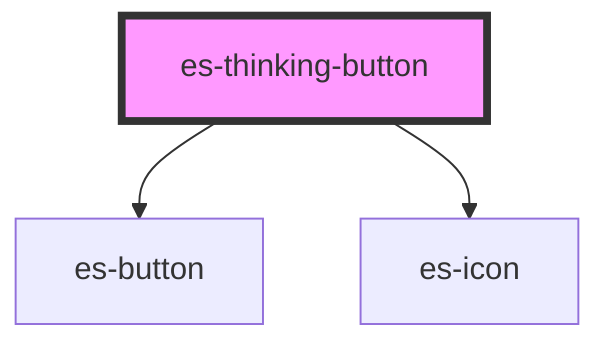

# es-thinking-button

<!-- Auto Generated Below -->

## Properties

| Property                   | Attribute       | Description | Type                                                         | Default     |
| -------------------------- | --------------- | ----------- | ------------------------------------------------------------ | ----------- |
| `action` _(required)_      | --              |             | `(e: MouseEvent) => Promise<unknown>`                        | `undefined` |
| `color`                    | `color`         |             | `"primary" \| "secondary" \| "text" \| "white" \| undefined` | `undefined` |
| `completeIcon`             | `complete-icon` |             | `string`                                                     | `'check'`   |
| `defaultIcon` _(required)_ | `default-icon`  |             | `string`                                                     | `undefined` |
| `disabled`                 | `disabled`      |             | `boolean \| undefined`                                       | `undefined` |
| `failedIcon`               | `failed-icon`   |             | `string`                                                     | `'error'`   |
| `text`                     | `text`          |             | `string \| undefined`                                        | `undefined` |
| `thinkingIcon`             | `thinking-icon` |             | `string`                                                     | `'spinner'` |
| `variant`                  | `variant`       |             | `"filled" \| "link" \| "minimal" \| "outline"`               | `'minimal'` |

## Dependencies

### Depends on

- [es-button](../buttons/es-button)
- [es-icon](../es-icon)

### Graph

----------------------------------------------

