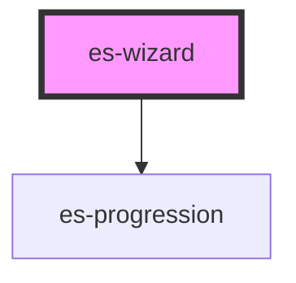

# es-wizard

<!-- Auto Generated Below -->

## Properties

| Property                | Attribute  | Description | Type           | Default     |
| ----------------------- | ---------- | ----------- | -------------- | ----------- |
| `location` _(required)_ | `location` |             | `string`       | `undefined` |
| `pages` _(required)_    | --         |             | `WizardPage[]` | `undefined` |

## Events

| Event                | Description | Type               |
| -------------------- | ----------- | ------------------ |
| `progressionRequest` |             | `CustomEvent<any>` |

## Dependencies

### Depends on

- [es-progression](../es-progression)

### Graph

----------------------------------------------

*Built with [StencilJS](https://stenciljs.com/)*
