# c2-icon

<!-- Auto Generated Below -->


## Overview

Displays an icon loaded from the `iconStore`. An icon named "spinner" will automatically spin.
See [IconStore](/components/variables/iconStore) for details on how to load icons.

## Usage

### Example

```tsx
import { icons } from 'utils/helpers';

export default () =>
    icons.map((icon) => <c2-icon key={icon} icon={icon} title={icon} />);
```

```css
:host {
    display: grid;
    grid-template-columns: repeat(12, minmax(12px, 1fr));
    gap: 10px;
    align-items: center;
    justify-items: center;
    justify-content: center;
    align-content: center;
}
```


## Properties

| Property            | Attribute        | Description                                               | Type                                                    | Default       |
| ------------------- | ---------------- | --------------------------------------------------------- | ------------------------------------------------------- | ------------- |
| `angle`             | `angle`          | Rotate the icon to a speciied angle.                      | `number`                                                | `0`           |
| `icon` _(required)_ | `icon`           | Which icon to display.                                    | `[namespace: string \| symbol, name: string] \| string` | `undefined`   |
| `size`              | `size`           | The hight and width to scale the icon to.                 | `number`                                                | `24`          |
| `spin`              | `spin`           | Apply a spin animation.                                   | `boolean \| undefined`                                  | `undefined`   |
| `spinDirection`     | `spin-direction` | When spinning, should it spin clockwise or anticlockwise. | `"antiClockwise" \| "clockwise"`                        | `'clockwise'` |


## Methods

### `spinEnd() => Promise<void>`

Provides a promise that resolves at the end of a single spin, if the icon is spinning.

#### Returns

Type: `Promise<void>`


## Shadow Parts

| Part     | Description        |
| -------- | ------------------ |
| `"icon"` | The internal icon. |


## Dependencies

### Used by

 - [c2-accordian](../accordian)
 - [c2-action](../actions/action)
 - [c2-action-dropdown](../actions/action-dropdown)
 - [c2-action-link](../actions/action-link)
 - [c2-action-with-confirmation](../actions/action-with-confirmation)
 - [c2-copy](../copy)
 - [c2-loading-dots](../loading-dots)
 - [c2-modal](../modals/modal)
 - [c2-pagination](../pagination)
 - [c2-progression](../progression)
 - [c2-table](../tables/table)
 - [c2-table-nested](../tables/table-nested)
 - [c2-table-virtualized](../tables/table-virtualized)
 - [c2-tabs](../tabs)
 - [c2-thinking-button](../buttons/thinking-button)
 - c2-toast

### Graph

```mermaid
graph TD;
  c2-accordian --> c2-icon
  c2-action --> c2-icon
  c2-action-dropdown --> c2-icon
  c2-action-link --> c2-icon
  c2-action-with-confirmation --> c2-icon
  c2-copy --> c2-icon
  c2-loading-dots --> c2-icon
  c2-modal --> c2-icon
  c2-pagination --> c2-icon
  c2-progression --> c2-icon
  c2-table --> c2-icon
  c2-table-nested --> c2-icon
  c2-table-virtualized --> c2-icon
  c2-tabs --> c2-icon
  c2-thinking-button --> c2-icon
  c2-toast --> c2-icon
  style c2-icon fill:#f9f,stroke:#333,stroke-width:4px
```


----------------------------------------------


