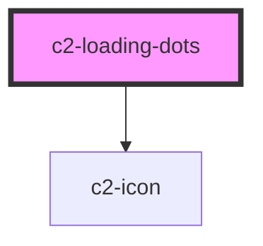

# c2-loading-dots


<!-- Auto Generated Below -->


## Overview

Display a row of five pulsing dots, to indicate loading.

## Usage

### Example

```tsx
export default () => <c2-loading-dots />;
```

```css
:host {
    display: flex;
    align-items: center;
    justify-content: center;
}
```


## Dependencies

### Depends on

- [c2-icon](../icon)

### Graph


----------------------------------------------


