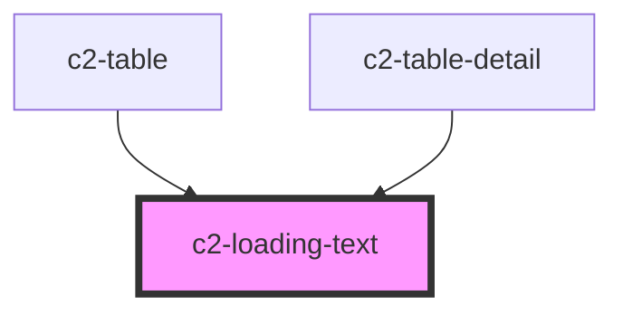

# c2-loading-text


<!-- Auto Generated Below -->


## Overview

Displays a grey block to placehold loading text.

## Usage

### Example

```tsx
export default () => (
    <>
        <c2-loading-text expectedLength={12} />
        <c2-loading-text expectedLength={12} variance={14} />
        <c2-loading-text expectedLength={12} variance={14} />
        <c2-loading-text expectedLength={12} variance={14} />
    </>
);
```


## Properties

| Property                      | Attribute         | Description                                             | Type                  | Default     |
| ----------------------------- | ----------------- | ------------------------------------------------------- | --------------------- | ----------- |
| `expectedLength` _(required)_ | `expected-length` | The expected loaded text length.                        | `number`              | `undefined` |
| `variance`                    | `variance`        | Adds a random number of chars (up to the passed amount) | `number \| undefined` | `undefined` |


## Dependencies

### Used by

 - [c2-table](../tables/table)
 - [c2-table-detail](../tables/table-detail)

### Graph


----------------------------------------------


