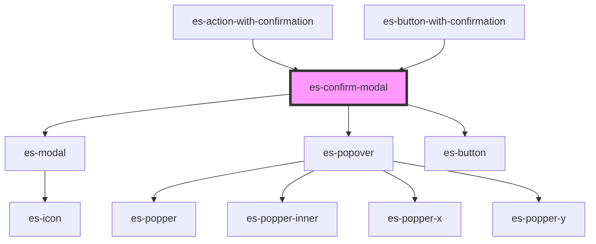

# es-confirm-modal

<!-- Auto Generated Below -->


## Overview

A modal to confirm an action.

## Usage

### Example

```tsx
// Despite being intended to be used with `es-action-with-confirmation` or
// `es-button-with-confirmation, `es-confirm-modal` can be used standalone.

import { createStore } from '@kurrent-ui/stores';

const { state } = createStore<{ open: boolean }>({
    open: false,
});

const requestClose = () => {
    state.open = false;
};

const deleteAndClose = () => {
    console.log('deleted!');
    state.open = false;
};

export default () => (
    <>
        <es-portal
            backdrop
            open={state.open}
            onRequestClose={requestClose}
            renderElement={(h) => (
                <es-confirm-modal
                    onRequestDeletion={deleteAndClose}
                    preHeading={'Group name'}
                    heading={'es-action-delete'}
                    body={
                        'Deleting this group will remove it from your organization. This operation cannot be undone.'
                    }
                    warning={
                        'Are you sure you want to proceed in deleting this group?'
                    }
                    confirm={'Delete group'}
                />
            )}
        />
        <es-button
            variant={'outline'}
            onClick={() => {
                state.open = true;
            }}
        >
            {'Open delete modal'}
        </es-button>
    </>
);
```


## Properties

| Property                  | Attribute         | Description                                               | Type                                                                                | Default     |
| ------------------------- | ----------------- | --------------------------------------------------------- | ----------------------------------------------------------------------------------- | ----------- |
| `body` _(required)_       | `body`            | Text or component to display in the body of the modal.    | `FunctionalComponent<{}> \| string`                                                 | `undefined` |
| `confirm` _(required)_    | `confirm`         | Text to display within the confirm button.                | `string`                                                                            | `undefined` |
| `confirmVariant`          | `confirm-variant` | Button variant for the confirm button.                    | `"cancel" \| "default" \| "delete" \| "filled" \| "link" \| "minimal" \| "outline"` | `'delete'`  |
| `heading` _(required)_    | `heading`         | Text to display in the heading.                           | `string`                                                                            | `undefined` |
| `preHeading` _(required)_ | `pre-heading`     | Text to display above the heading.                        | `string`                                                                            | `undefined` |
| `typeToConfirm`           | `type-to-confirm` | String required to be typed to enable the confirm button. | `string \| undefined`                                                               | `undefined` |
| `warning`                 | `warning`         | Text to display in red below the body.                    | `string \| undefined`                                                               | `undefined` |


## Events

| Event             | Description                                                              | Type               |
| ----------------- | ------------------------------------------------------------------------ | ------------------ |
| `requestClose`    | Triggered when the user has indicated that they want to close the modal. | `CustomEvent<any>` |
| `requestDeletion` | Triggered when the user has indicated that they want to close the modal. | `CustomEvent<any>` |


## Shadow Parts

| Part                | Description                             |
| ------------------- | --------------------------------------- |
| `"body"`            | The body of the modal.                  |
| `"cancel"`          | The cancel button.                      |
| `"confirm"`         | The confirm button.                     |
| `"heading"`         | The h1 heading.                         |
| `"preheading"`      | The h2 above the heading.               |
| `"type_to_confirm"` | The type to confirm label (if enabled). |
| `"warning"`         | The warning text (if provided).         |


## Dependencies

### Used by

 - [es-action-with-confirmation](../../actions/es-action-with-confirmation)
 - [es-button-with-confirmation](../../buttons/es-button-with-confirmation)

### Depends on

- [es-modal](../es-modal)
- [es-popover](../../es-popover)
- [es-button](../../buttons/es-button)

### Graph


----------------------------------------------


